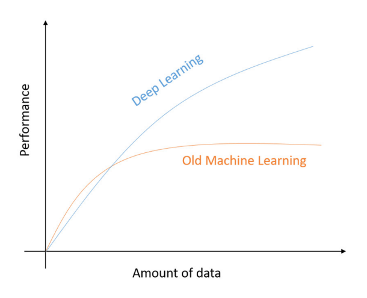
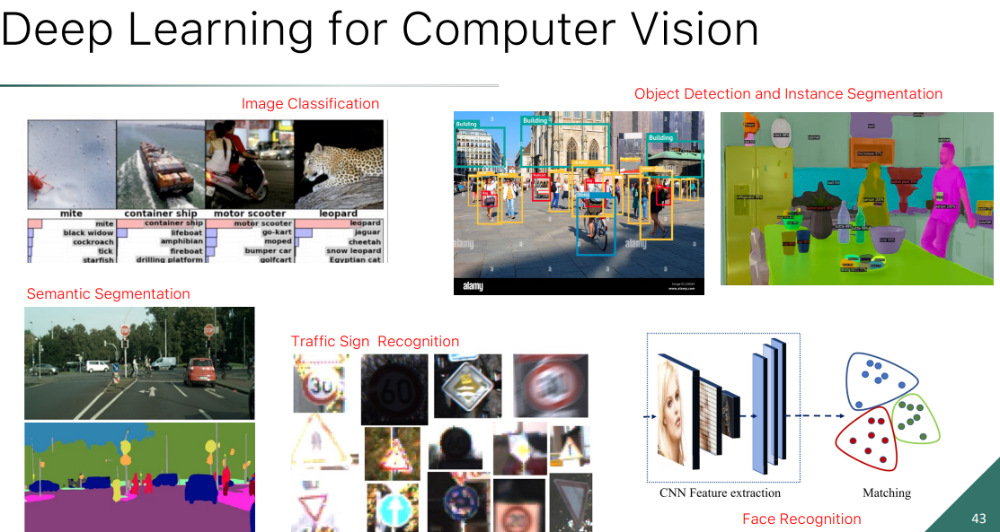

_Computer vision is a field of Artificial Intelligence, that deals with extraction of information from images._ 
 (example of Image Classification) 
 
In the last years, with the advent of [Deep Leaning], its performance and usage has been increasing exponentially. 
 
# Deep Learning CV tasks 
Uses Deep Learning computer visiones to solve complex tasks relying on the training data. 
 
- Image classification 
- Semantic segmentation 
- Object detection and Instance segmentation 
- Face recognition 
- Traffic sign recognition