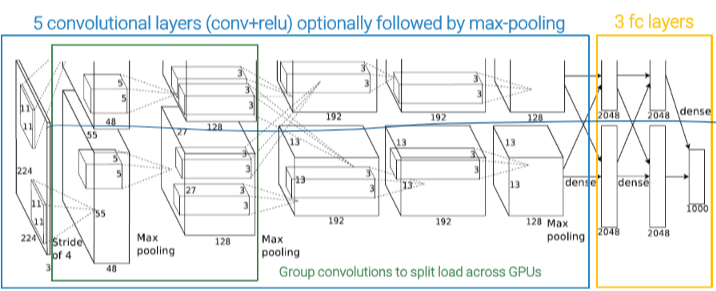
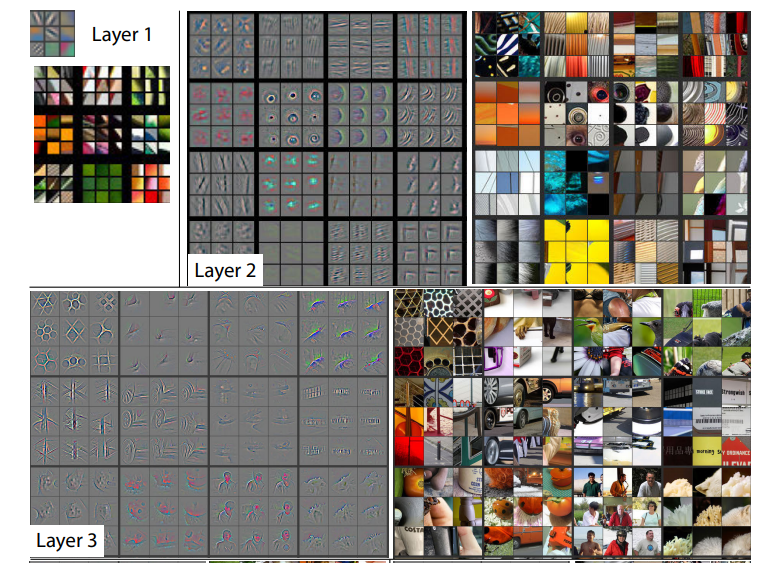

_The first Deep Learning computer vision classifier to win the ILSVRC contest in 2012, before there were only Bag of words#VLAD._ 
By Geoffrey Hinton, Ilya Sutskever and Alex Krizhevsky. 
 
It is an evolution of LeNet, with 5 convolutional layers + ReLU, some of them followed by maxpooling. Finally 3 Fully connected layers. 
 
Works with 2 parallel GPUs (using ResNet#Grouped convolutions), each of them is responsible of computing half the network (blue line in the image) 
## Architecture breakdown 
- **1st** (stem): 96x11x11 conv **s=4** + 3x3 maxpool s=2 
	- Stem layer to reduce spatial size: from 227 to 55 
- **2nd**: 256x5x5 conv s=1 + 3x3 pool s=2 
- **3rd**: 384x3x3 conv s=1 (no maxpool) 
- **4th**: 384x3x3 conv s=1 (no maxpool) 
- **5th**: 256x3x3 conv s=1 + maxpool 3x3 s=2 
- **6th** (dense): flatten + 4096 dense + 4096 dense + 1000 dense + softmax activation (output) 
 
Nearly all parameters are in the fully connected layers. 
The first stem layer takes the most activation memory (big convolution 11x11) 
The largest number of flop is required by the conv layers 
 
 
# ZFNet 
An improved AlexNet (won in 2013). Introduces deconvnets for layer visualization. This allowed to find structural flaws like too large filter sizes and strides (2 instead of 4). 
Thy showed that the learned filters are far from random, uninterpretable patterns. 
### Deconvnet 
Understanding the operation of a convnet requires interpreting the feature activity in intermediate layers. Deconvnets are a way to map these activities back to the input pixel space, showing what input pattern originally caused a given activation in the feature maps.  
 
It can be thought of as a convnet model that uses the same components (filtering, pooling) but in reverse, so instead of mapping pixels to features does the opposite.  
