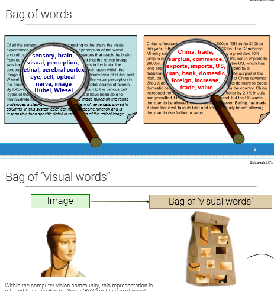
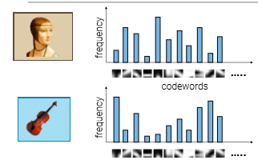
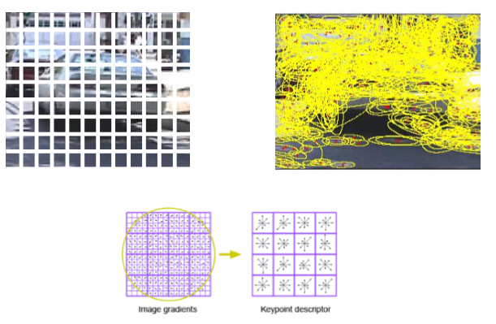
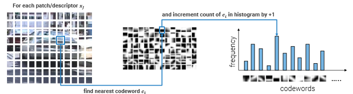

_Shallow Machine Learning approach to Image classification, inspired from NLP._ 
 
# NLP approach 
In Natural Language Processing, the Bag of Words (BoW) method is a way to classify a text using only a few keywords extracted from the text. 
 
In the same way, we could extract a bunch of "visual keywords" to build a **Visual Bag of Words**. 
 
We would like to represent an image as an histogram counting the frequency of appearance of visual words from a dictionary 
 
Visual words can be extracted using a regular grid, or keypoint Detector (i.e.Detector#Difference of Gaussian (DoG) and Detector#Harris Corner Detector) and then computing its SIFT#Descriptor and using it as a word. 
 
We then cluster the keypoints in a finite set of centroids, using K-Means, obtaining a "**codebook**" 
 
Given an image, we apply the same word extracting pipeline, and assign the descriptor to the nearest centroid in the codebook. 
 
After applying this process to every image of the train set, we use the histogram as classifier (instead of using the pixels). 
This is a **fixed-sized representation**, that works also with images of different sizes (if we normalize the histogram). 
 
# VLAD 
Stands for Vector of Locally Aggregated Descriptors 
It's the successor of the vanilla BoW, making the codeword assignment more informative: stores the difference of input words with respect to the codewords (relative position). 
