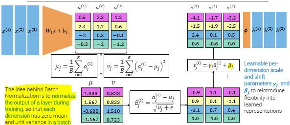
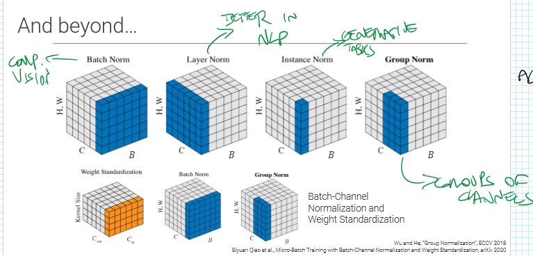

### Internal Covariate Shift (ICS) 
_"We define Internal Covariate Shift as the change in the distribution of network activations due to the change in network parameters during training."_ 
LeNet is the first CNN, made in 98. It didn't have much success because of the low computational resources of the time, and because of the Internal Covariate Shift problem. 
Even when using ReLUs, deep architecture were very slow to train for that problem. 
## Batch normalization 
Normalize the output of a layer **during training**, so that each dimension has **zero mean and unit variance in a batch**. 
It implies to learn parameters $\gamma_{i}$ and $\beta_i$ to reintroduce flexibility. 
 
Batchnorm behaves differently based on batches values. Since we want this layer to behave deterministically during test time, we take $\mu_j$ and $\nu_j$ as constants (the average of the values computed at train time). Batch norm becomes a linear deterministic transformation, to be applied between conv layers, and has different benefits: 
- allows higher learning rates 
- initialization of parameters is less important 
- no overhead during test 
 
 
### Linear Normalization 
Unlike Batch normalization, Linear normalization normalizes each input vector (i.e. each training sample) in isolation, so that each vector has zero mean and unit variance, regardless of other batch elements. 
 
 
