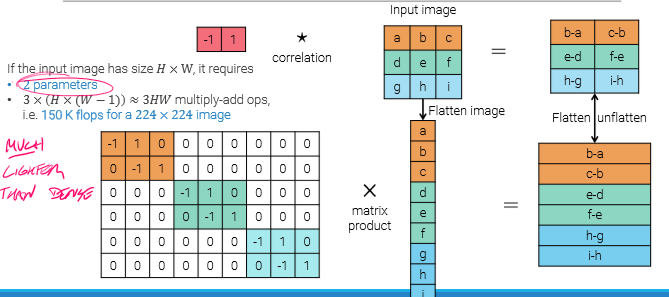
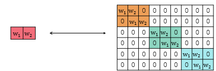
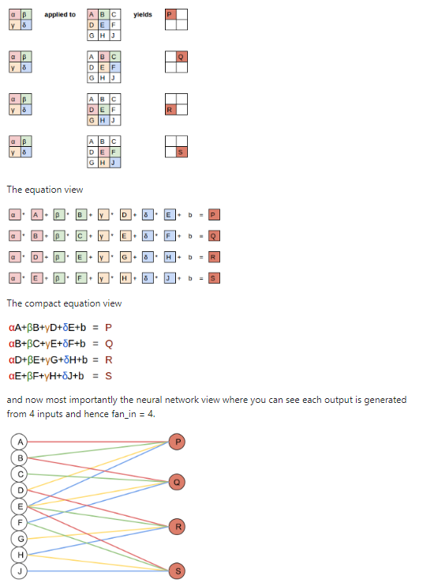
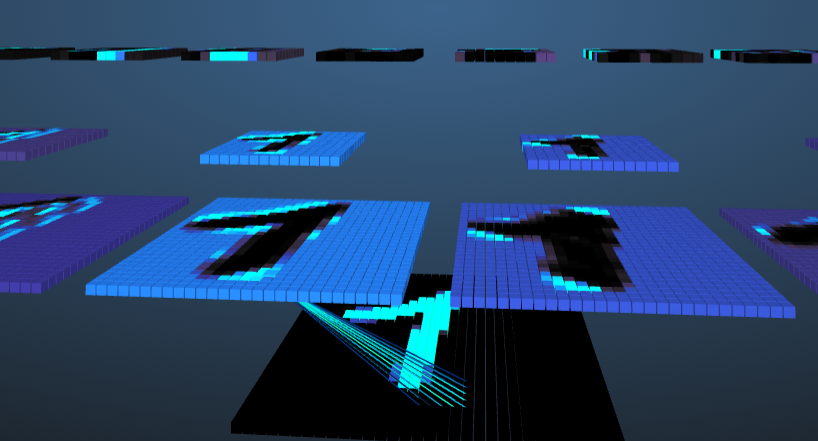
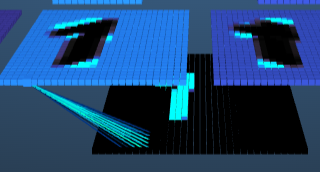
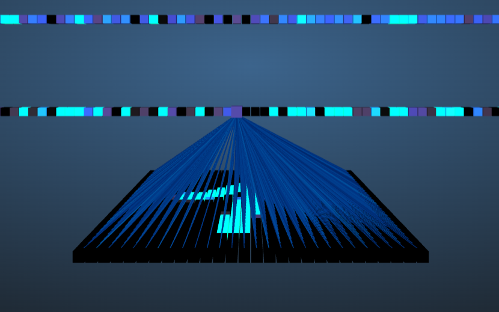
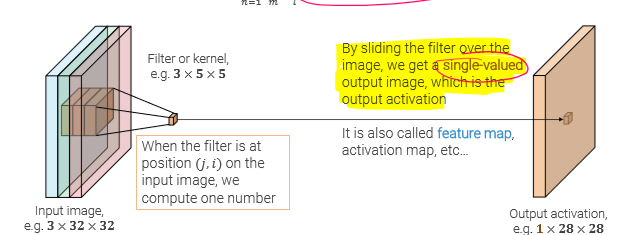
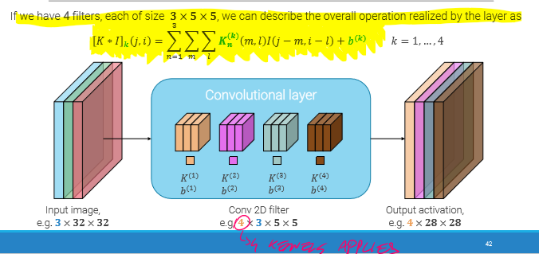
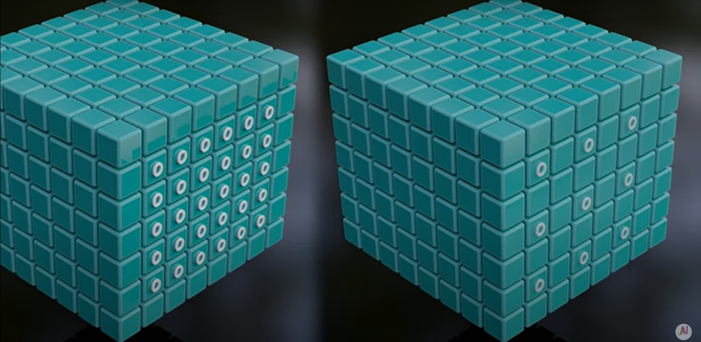

 
In traditional Image Processing, for Image Filters we rely on Image Filters#Convolutions with handcrafted filters. 
We could build convolutional layers that have the objective to learn the composition of such filters from data. 

- Input and output are not flattened, preserving the spatial structure 
- The parameters associated with connections are the same for all output units, so **parameters are shared** and the convolution learns the same detector regardless of the input position. 
- A convolution only processes a small set of neighbor pixels at a time, like in the Visual cortex#Receptive field. 
- Image exhibit informative **local** patterns that may appear anywhere across an image, that's why convolutions are so effective with images. 
   
  In this case we need only 2 parameters, while before we used $H^2W^2$. 
   
  Convolution can be seen as a matrix multiplication operation if we reshape inputs and outputs. It's a linear operator which: 
- **shares parameters** across nodes 
- It's **sparse** 
- Adapts to different input sizes 
- **Equivariant to translations** of input (not rotation and scale) -> $T(x)*K=T(x*K)$. Allows for better generalization and data efficiency, possible thanks to weights sharing. 
   

## Conv layer vs dense layer 

We can see below that Conv layers are just dense layers which aren't fully connected. the weights of the connections are the kernel values, and are shared between neurons, as seen below. 
 
To better understand how weight sharing works and how CNN differs from FC networks, look at this [useful website](https://adamharley.com/nn_vis/). Below we have a comparison of CNN vs FC network for MNIST dataset handwritten digits classification. 
**CNN example:** 
 
Notice that even if select another pixel, the weights will be the same, but they will be looking at a different part of the input image (like if we are applying a convolution) 
 
 
**FC example:** 
Here we have that each single node of the first FC layer looks at every pixel of the input image. We have many more parameters to compute. 
 

# Channels 

Colored images have 3 channels, corresponding to a 3D tensor $3\times H\times W$. 
We need to have 3 kernels: one for each channel ($3\times K \times K$). 
Each filter generates a single channel **feature map**.  
 
 
To get **more output channels**, we need to use multiple filters and stack the ouptuts. 
 
In general, we can have as many input and output channels as we want, as long we use the right kernel dimensions. 
 

# Stride 

How many pixels to shift each time we apply a convolution. 
Stride 1 vs stride 2: 
 
It is a useful way to reduce the spatial size of the output (downsampling). 
Most often, to downsample we use Max pooling with stride > 1 
Here is a video about [**padding and stride**](https://www.youtube.com/watch?v=3TdBtI9dh2I) 
