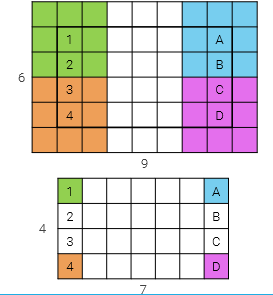
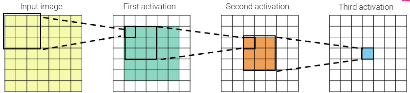
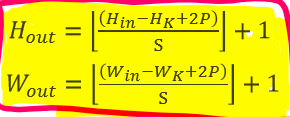
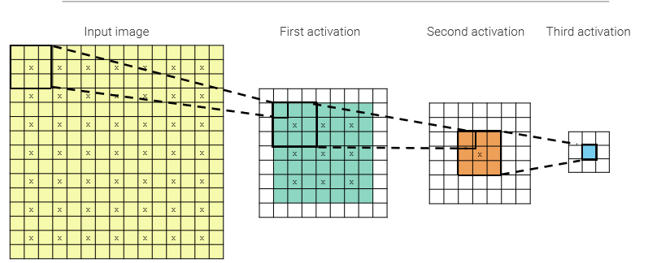
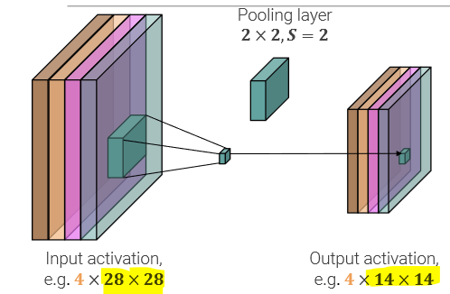
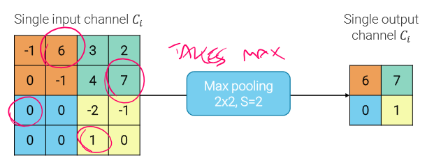
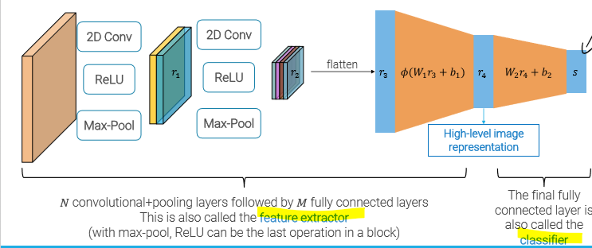

_Convolutional Layers are just constrained forms of linear layers, more useful and appropriate to deal with images or signals._ 
 
If we want to stack more layers, we still need to use non-linear activation functions. 
## Padding 
If we stack multiple layers, size will shrink if we don't use padding ("valid"). 
It's common to use zero or same padding to extend the input image and obtain the same image size after each conv layer. 
 
When applying a filter of size $k*k$ to a $n*n$ image, the output of the convolution will be of size $n-k+1$. 
When adding padding of size p to the image, it becomes of size $(n+2p)*(n+2p)$, so in order to the output to remain $n*n$, the padding should be: $$p=\frac{k-1}{2}$$ 
## Receptive field 
The input pixels affecting a hidden unit are called **receptive field**, and works much like the Visual cortex#Receptive field. 
To obtain large receptive fields with a limited number of layers, we **downsample** the activations inside the network. 
 
## Strides 
The stride indicates how many pixels we want to move right when we slide the kernel over the image. 
The strides affects the output image (feature map) size, and for a given s, we get: 
 
 
so, given size $n*n$, kernel size of $k*k$, padding p and stride s, we get an output size of: $$[(\frac{n-k+2p}{s})+1]*[(\frac{n-k+2p}{s})+1]$$ 
The size of the receptive field grows exponentially with respect to the number of layers with stride>1 
 
In general, we should not have s>k (size of stride bigger than the size of the kernel), otherwise we would miss some rows and columns of pixel. 
## Pooling  
Pooling layers are able to downsample the image by aggregating pixels with a pre-specified kernel (not learned).  
It's different from convolution layers, since each input channel is aggregated independently ($C_{out}=C_{in}$). 
 
The most common pooling kernel is the **MAX-POOLING**, which only takes the pixel with the biggest value in a given neighborhood  
 
# Architecture 
The basic architecture used for image classification is composed of multiple conv layers with ReLU activations, Max-pooling and Batch normalization between each layer, end ends with a couple of fully connected linear layers that takes the flattened last conv layer to make the final classification (it has a global receptive field). 
 
CNN became much more powerful after the introduction of Batch normalization in 2015, which solves the Batch normalization#Internal Covariate Shift (ICS) problem, allowing for better learning and deeper networks. 
# Popular architectures 
- AlexNet 
- VGG 
- Inception 
- ResNet 
- EfficientNet 
- MobileNet V2