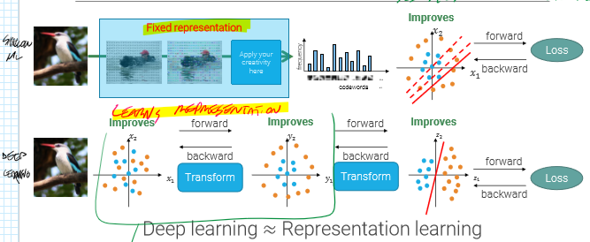
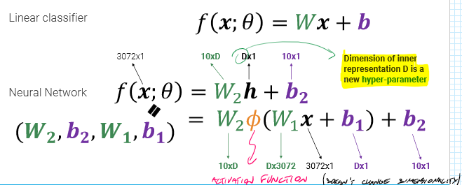
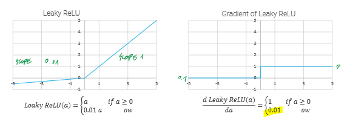
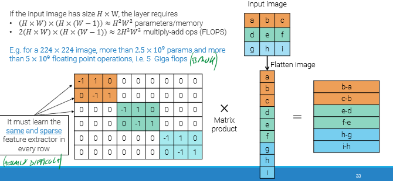

We can use Machine Learning approaches for image Classification, without relying too much on complicated algorithm, letting the computer do the hard work given enough training labelled data (e.g. Imagenet dataset). 
Traditional or classical Computer vision only relies on handwritten algorithms. 
 
# Neural networks 
Using Deep Learning and Neural Networks (MLP) has proven to be a major breakthrough in Computer Vision, for many kinds of tasks, thanks to Gradient descent which greatly improves the problems associated with the Image classification#Curse of dimensionality. 
 
Compared to the Bag of words (Shallow ML approach) for image classification for example, we can see that instead of having a fixed representation, the neural network can learn its own representation: 
 
### Activation function 
 
In the image above, $\phi$ represents the **Activation function**: a non-linear function applied to every element of the input tensor. 
This element is essential to catch non-linear relationships in the data, and without it we would just have a simple linear classifier. 
### Most common activation functions 
- **Sigmoid** -> maps into $[0,1]$ range, but has the **vanishing gradient** problem (it's best to use it only as an output layer if we need a binary label). 
- **ReLU** (Rctified Linear Unit) -> solves vanishing gradient, but can cause dead neurons 
 
- **Leaky ReLU** -> solves ReLU's problems  
 
- Gradient descent#Softmax activation function  
# Deep Neural Networks 
Neural networks with just one hidden layer are **universal approximators** (can approximate any mathematical function), and NNs with >2 hidden layers are called _"**Deep** Neural Networks"_. 
If we stick to only 2 layers, the width of the network needs to grow exponentially with the number of inputs (not acceptable with flattened images). If we instead increase the number of layers, the width can grow **linearly**! 
 
## Limits of Fully Connected layers 
Given an image of size HxW, the layers require a lot of memory and FLOPS, which are mostly wasted, since the network has to learn a sparse feature extractor: 
 
Not only it's a very difficult process, but it's also not efficient at all. 
We should use instead Convolutional Layers. 
 
