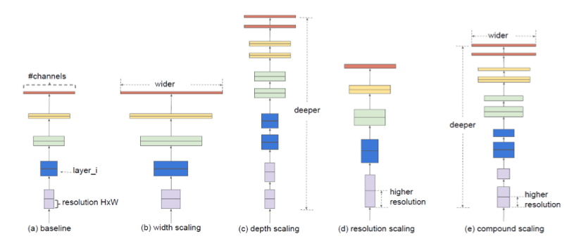
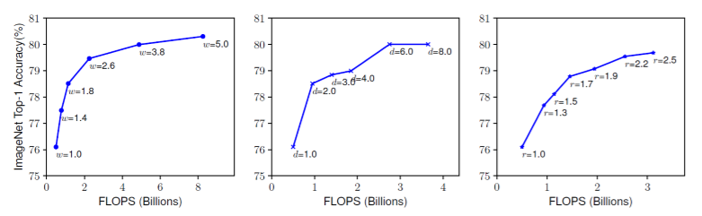
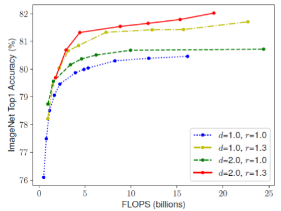
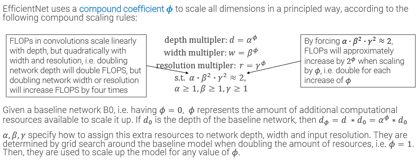
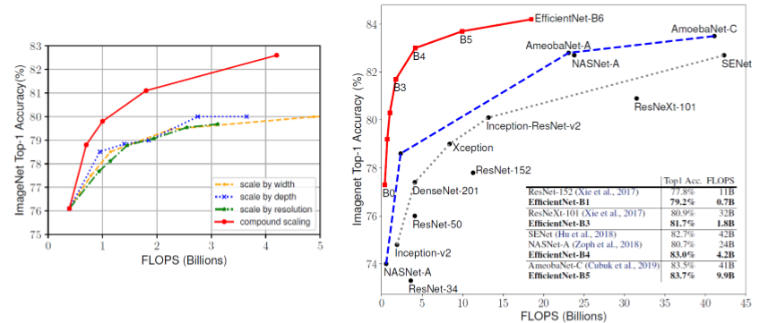

_Scales ResNet in depth, width and resolution in an optimal way._ 
## Scaling ResNet 
ResNet allowed to scale depth. 
Model scaling can also increase width (n° of channels) or resolution: 
 
## Compound scaling 
The best solution, is scaling everything together: **compound scaling** 
In fact, by only scaling one dimension (inevitably increasing flops), we reach a plateau around 80% accuracy 
 
In the graph below, width is increased. The other two parameters variation changes depending on the color of the line. 
The red line represent variation in all dimensions, and is able to reach the highest score, while also using less flops than other ones: 
 
### Compound scaling coefficient 
Flops increase linearly for depth, but quadratically for width and resolution. we want that the product of all 3 coefficients to be around 2: 
 
It is like a linear programming problem, performing grid search to find the optimal combination of parameters. 
# EfficientNet-B0 
The baseline network for EfficientNet was searched using **Neural Architecture Search** (a neural network which optimizes ResNet architectures), letting it perturb a model similar to MobileNet V2. 
It ended up alternating apparently random convolution sizes (3x3 and 5x5), while always using Squeeze and Excitation modules (from ResNet#SENet). 
 
Indeed EfficientNet managed to score the highest accuracy with moderate flops compared to its competitors. 
 
