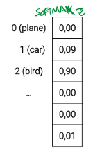

_The algorithm used in Neural Networks (MLP) to optimize the parameters. (and to perform training)._ 
# Optimization 
To solve the curse of dimensionality problem, we convert it to a similar, simpler problem: minimizing a **loss function** which is related to the actual problem. 
This objective function is much simpler to optimize, and if chosen correctly, will result in a good outcome for the original problem. 
- if the loss is high, the classifier is bad -> LOW ACCURACY 
- if the loss is low, the classifier is good -> HIGH ACCURACY 
$$\theta^*=argmin_{\theta}L(\theta,D^{train})$$ 
The parameters to optimize ($\theta$) are those of the loss function, and the input of the latter is the training data (pixels of the images). 
## Loss functions 
The kind of loss function we want to use depends on how we want to represent the label. 
### RMSE loss 
Uses the **one-hot encoding** for the label representation: 
$$L(\theta,(x^i,y^y)))=L(Wx^{i}+b, y^i)=||Wx^{i}+b-1hot(y^i)||_2$$ 
 
 
### Softmax activation function 
There are practical reason to prefer a loss that transforms the scores computed by the classifier into **probabilities**, then perform MLE of $\theta$. 
Softmax is an **activation function** (NOT a loss), which represents the label as a mass probability vector 
$$p_{model}(Y=j|X=x^{i};\theta)=softmax_{j}(s)=\frac{exp(s_j)}{\sum\limits_{k=1}^{C}exp(s_k)}$$ 
 
### Cross-entropy loss 
Cross-entropy loss relies on the probability mass vector given by the Softmax activation function, and performs MLE estimation to find the optimal parameters $\theta$: 
$$\theta^{*}=argmax_{\theta}p_{model}(y^{1}, \dots , y^{N}|x^{1}, \dots,x^{N}, \theta)=\dots=argmin_{theta}\sum\limits_{i=1}^{N}-log(p_{model}(Y=y^{i}|X=x^{i}; \theta))$$ 
Given an example of predicted label, with a softmax activation: 
 
- If the true class is bird (hence the model was correct), the cross-entropy loss computed is 0.1 (=-log(0.9)), 
- If the true class is car, the loss is 2.4 (=-log(0.09)), which is a much higher value, that has much more impact when updating the parameters. 
 
# Gradient descent 
The algorithm that updates the parameters of Neural Networks (MLP), thus performing the actual learning.  
It kinda resembles the natural way in which Neurons change their connections with Surprise#Prediction error. 
 
1. **Forward pass** -> compute prediction and its loss 
2. **Backward pass** -> compute the gradient for all nodes, starting from the output going back to the input. 
	It is a non trivial operation, which can be performed: 
	- numerically, applying the derivation formula 
	- analytically, applying the chain rule  
	- algorithmically, with **backpropagation** 
1. **Update parameters** -> update values of each node according to gradient values: $$\theta^{n}=\theta^{n-1}-\alpha g$$Where $\alpha$ is the learning rate and $g$ the gradient (similar to Surprise#Rescolra-Wagner model of Pavlovian conditioning)