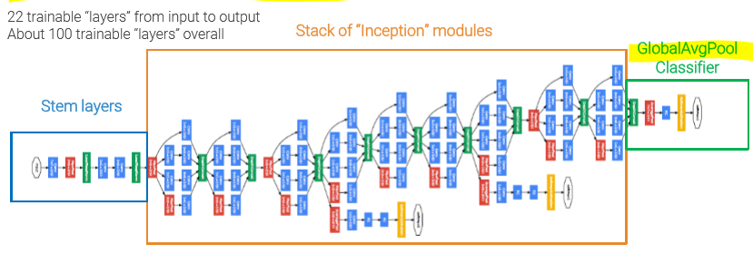
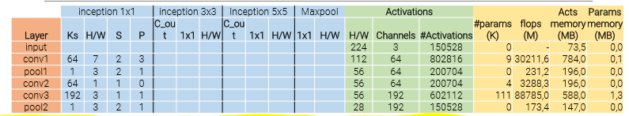
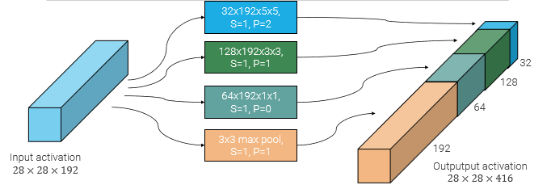
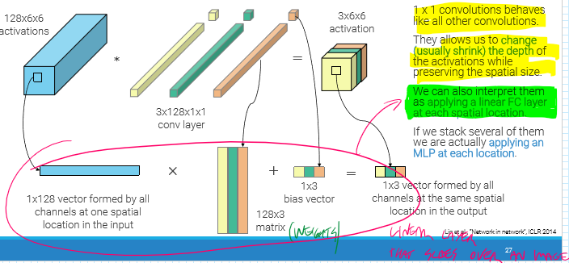
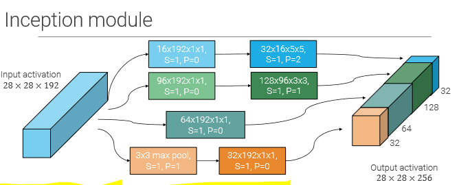
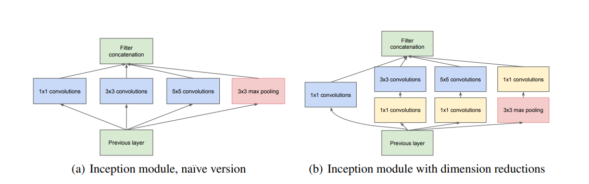
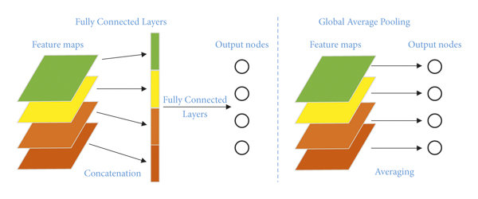

 
_aka GoogLeNet  
With the aim of reducing computing resources to scale the model, exploiting "inception modules" and increasing depth and width while keeping the computational budget constant._ 
It can process multiple activations in parallel 
 
Here is a video about [**Inception by Andrew
NG**](https://www.youtube.com/watch?v=KfV8CJh7hE0) 
 

# Stem layers 

Have the objective of strongly downsample the input from 224 to 28, with half the flops as VGG. 
LAYERS: 

- conv 7x7 stride 2 
- maxpooling 3x3 stride 2 
- conv 1x1 stride 1 
- conv 3x3 stride 1 
- maxpooling 3x3 stride 2 
   

# Inception module 

The main reason of the inception module is to try different approaches of layers altogether, and combine them (as if it were an Ensemble). 
Due to maxpooling, which doubles the n°of channels, the total number becomes prohibitively expensive with big convolutions 
 
Here is a video about [**inception reason by Andrew NG |
200**](https://www.youtube.com/watch?v=C86ZXvgpejM) 

## 1x1 convolution 

Introduced in the [Network in Network](https://arxiv.org/pdf/1312.4400v3.pdf) paper in 2013. 
Here is a video about [**1x1 conv by Andrew
NG**](https://www.youtube.com/watch?v=c1RBQzKsDCk) 
And here is one about [**short 1x1 conv**](https://www.youtube.com/watch?v=qVP574skyuM&t=58s) 
A good solution is using **1x1 convolutions**, which allows to shrink the activation depth (n° of channels) while preserving spatial size. 
It's like applying a linear fully connected layer at each spatial location (all the channels of a pixel) 
 
The final inception module exploits this property by applying 1x1 convolutions **before** large convolutions and after maxpooling. 

- Drastically reduces number of output channels: 
  - 16 instead of 192 for the 5x5 
  - 96 instead of 192 for the 3x3 
  - after maxpool we end up with 32 channels instead of 192 
  - **total output channel is 256, instead of 416** 
- Time complexity is reduced for convolutions 
- Less parameters 
   
   
  So the final inception module is composed of 4 parallel paths: 
- 1x1 conv + 5x5 conv 
- 1x1 conv + 3x3 conv 
- 1x1 conv  
- 3x3 max pooling + 1x1 conv (to drastically reduce the channels) 

## Global Average Pooling 

Instead of using expensive fully connected layers as classifiers, Inception obtains the same result by first applying average pooling (takes average of the neighborhood), requiring drastically less parameters. 
In the end only **one fully connected layer** with softmax activation is applied to predict the classes. 

