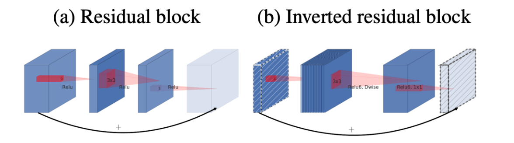
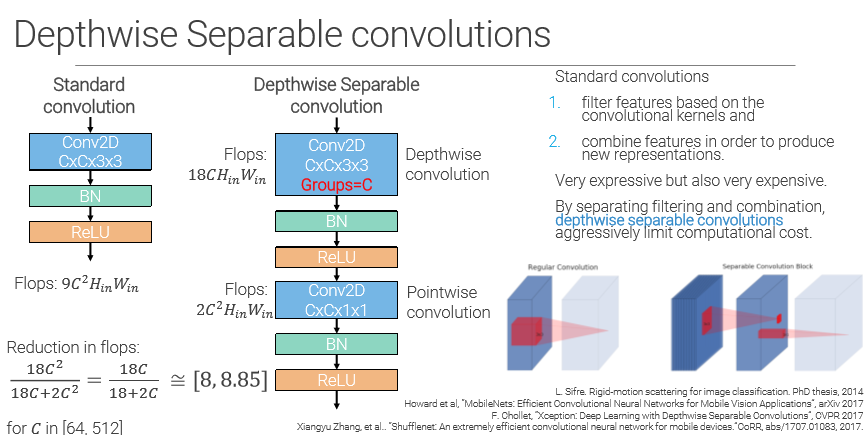
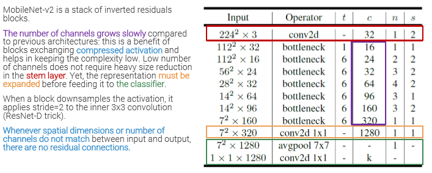

_A fast ResNet thought to be implemented in smartphone. 
It uses **inverted residual blocks** and **Depthwise separable convolutions**._ 

## Inverted residual blocks 

MobileNet solves this issue by using **inverted residual blocks**, where  

- the first 1x1 layer expands the channels 
- second compresses back again 
- expansion works according to an **expansion ratio t** 
- There are no ReLUs between residual blocks 
   
   

# Depthwise separable convolution 

The inner 3x3 conv layer is implemented as a depthwise separable convolution: 
Instead of doing one big convolution, the matrix is split in 2, and we just do two smaller convolutions. The result is the same, but the complexity is **much** smaller. 
Splits the computation into two steps:  

- **Depthwise convolution** is used to create a linear combination of the output of the depthwise convolution. Uses grouped convolutions to have filter of only one channel. (3x3 filters of channel 1 in the gif below) 
- **Pointwise convolution** is used to create a linear combination of the output of the depthwise convolution (1x1 conv with n channels in the gif) 
   
  Using this kind of convolution allows to deal with more channel, while keeping the cost down. The groups are computed in parallel, allowing a speedup up to 9x!!! 
   
   
  Here is a video about [**Depthwise separable convolution**](https://www.youtube.com/watch?v=vVaRhZXovbw) 

## Architecture 

MobileNet V2 is a stack of inverted residual blocks: 
 
Has few parameters since stem layer does not have to make heavy downsampling, and channels grow slowly
