_Very deep network that uses residual connections and Batch normalization, easy to optimize._ 
 
It has been observed that when scaling Convolutional Neural Networks, not always the performance increases, due to training problems, since optimizing very big networks is hard. 
They are easy to optimize, making it possible to train deeper networks (which are also more accurate) 
 
In standard networks (green), having more layers also means having more **train** error. ResNet aims to solves this problem with a heavy use of Batch normalization. 
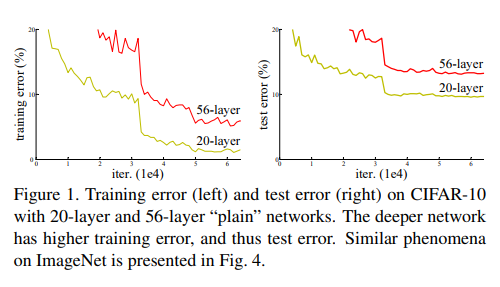 
Here is a video about [**ResNet**](https://www.youtube.com/watch?v=o_3mboe1jYI) 

## Residual block 

The solution is changing the network, by allowing to learn identity functions thanks to **residual blocks**, implemented by adding **skip connections** between input and last activation. 
A skip connection is just a concatenation: 
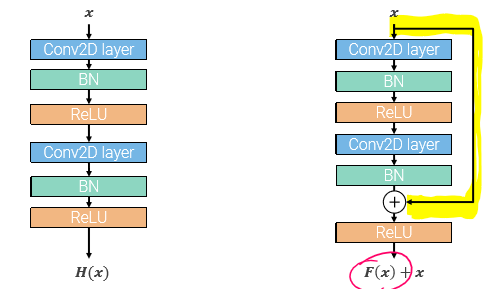 
This network makes a heavy use of Batch normalization, using it after any convolution operation (even 1x1). This allows to have really deep networks without having bad consequences on the learning. 
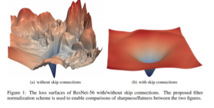 
We can see below that in ResNet (middle graph), increasing the layer count does not affect as much the training and test error, as opposed to the plain network (Same resnet architecture, without skip connections). 
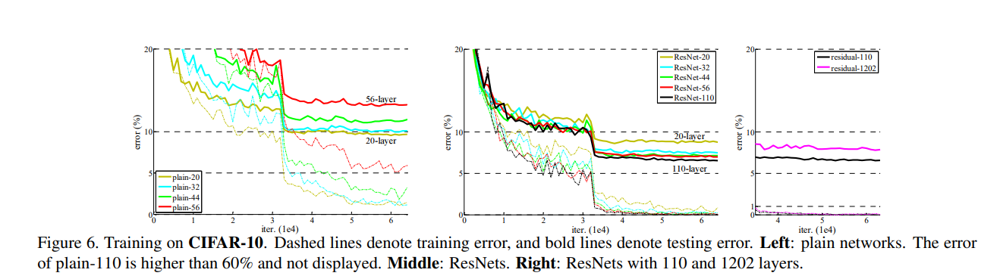 

# Residual Network 

They are inspired by VGG's regular design, stacking together fixed stages: 

- stages are stacks of residual blocks 
- **each residual block is a stack of two 3x3 conv with batch norm and ReLU in between** 
- First block (conv layer) of each stage halves the resolution and doubles channels by using stride 2 
- uses an initial stem layer to first reduce the resolution 
- end with a global average pooling layer like Inception 
  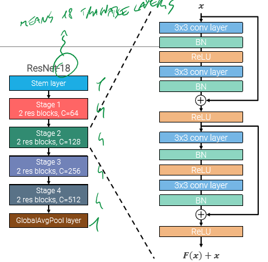 

## Stem layer 

- convolution 7x7 stride 2  
- maxpool 3x3 stride 2 
  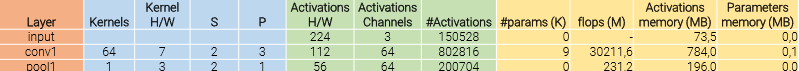 

## Skip connections 

- ResNet blocks never use maxpooling to downsample, instead the first 3x3 convolution will have stride 2 and double the channels 
- Since the size halves (for the stride=2) and the number of channels doubles **after** the first conv layer of a stage (since we use 2C filters), the skip input would not match with the stage output.  
- To solve this, it's best to apply a 1x1 convolution with stride 2 and 2C filters (followed by batch norm), so we can successfully apply the sum. 
  _(remember: the number of filters determine the number of output channels. The number of filter channel must be the same of the number of input channels)_ 
  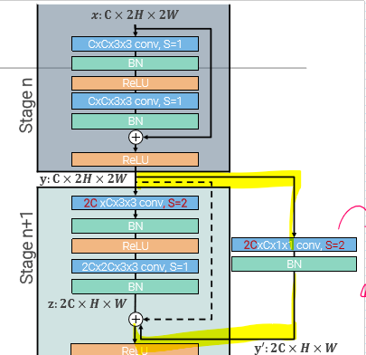 
  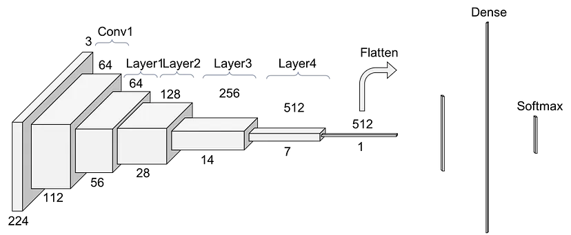 

## Bottleneck residual block 

- When designing very deep residual nets, it's best to use these kind of block, which enable faster depth increase without altering computational budget. 
- Adds a third 1x1 conv layer before adding the skip, with 4 times the number of channels. Also the first conv layer is 1x1. Only one 3x3 layer in the middle. 
- The 3x3 conv layer operates in a compressed domain (might lead to information loss) 
   

# Inception-ResNet 

Inception modules with skip connections 
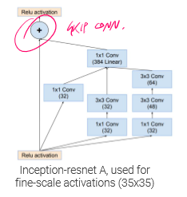 
The whole network has the same structure of vanilla ResNet, but uses Inception-resnet blocks instead. 

# ResNeXt 

Decomposes #Bottleneck residual blocks into G parallel branches, though the complexity remains similar to a standard ResNet block. 
Only one skip connection is present for all the G branches: 
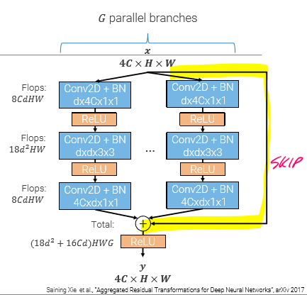 
Follow the **split-transform-merge** paradigm. 

## Grouped convolutions 

A technique to split the input and output channels into G groups, obtaining the same result but with less filter channels, thus reducing parameters and flops, allowing parallel computation with multiple GPUs 
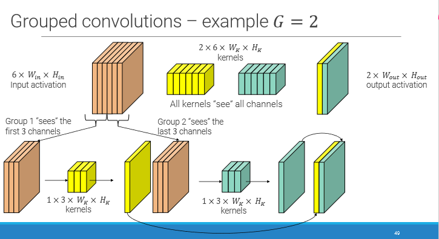 
ResNext uses grouped convolutions in residual blocks, so it can have more paths while keeping the n° of parameters small. 
 
The ResNext block is approximately an #Inception-ResNet block 
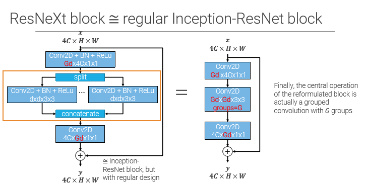 

## SENet 

Uses a **squeeze and excitation** module to capture global context ant to reweight channels in each block. 
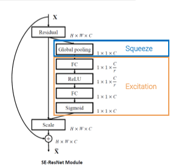 

- squeeze = global average pooling 
- excitation = FC+ReLU+FC+sigmoid 
  There are 2 skip connections:  

1. vanilla between input and last relu 
2. between residual block and scale after the S-E block 
    
