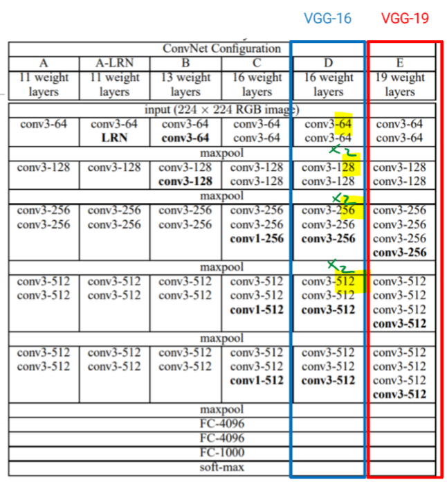
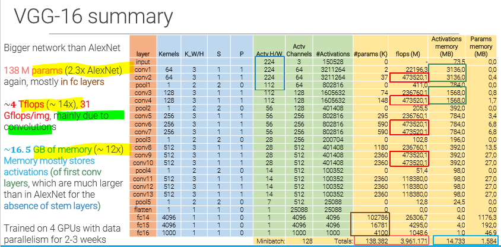

_Very **simple and schematic** network, divided into **stages** of fixed components. _ 
 
Uses a combination of: 

- **3x3 conv** with stride 1, P 1 
- 2x2 max-poolig stride 2, P 
  and doubling n° of channels after each pool 
  finally 3 fully connected layers and a softmax activation. 
   
  PROS: 
- simple and schematic = easy to code 
  CONS: 
- It has a lot of parameters (many channels) = slow 
   
  pre-initialization of weight was still necessary since batchnorm was not invented yet 
   
- There is a repetition of "**stages**" 
  a stage for example is $conv+conv*2+pool$, or $conv+conv+conv+pool$. 
- One stage ha same receptive field of larger convolutions, but requires less parameters and computation, introduces non-linearities. 
- After each downsampling of the image size (with maxpool), the number of channels is doubled, to keep the computational cost per layer constant, and still having a bigger receptive field. 
   
   

## 3x3 convolutions 

With VGG came the understanding that we don't need large convolutions, and that multiple 3x3 convs can have the same effect of a bigger one.  
Smaller convolutions = less parameters = less computation.  
Although, in the first layers (stem), it's best to use bigger convolutions to rapidly squeeze the image. 
Here is a video about [**3x3 conv**](https://www.youtube.com/watch?v=V9ZYDCnItr0) 

### VGG-16 

 
 
Here is a video about [**VGG**](https://www.youtube.com/watch?v=YcmNIOyfdZQ) 
