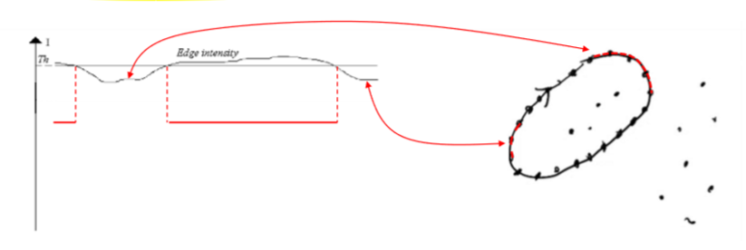
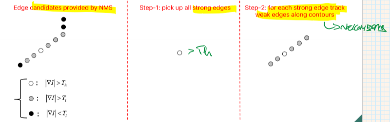
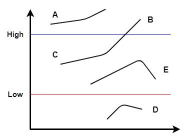
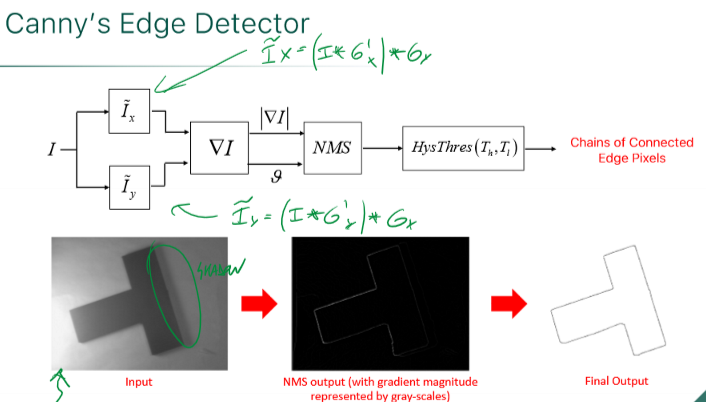
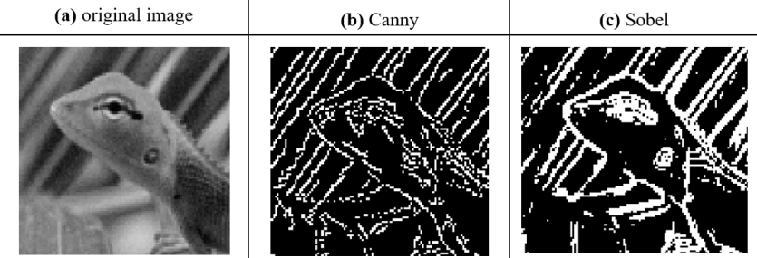

_Edge detection algorithm, and most cited paper on Image Processing and Edge Detection. Defines **three criteria** that a good edge detector should have._ 
 

# Criteria 

 
- **GOOD DETECTION** -> must correctly extract edges also in noisy images 
- **GOOD LOCALIZATION** -> the distance between true and found edge should be minimal 
- **ONE RESPONSE TO ONE EDGE** -> Filter should detect **one** single edge pixel  at each true edge (sharp edges) 
 
## Simple implementation 
Canny's edge detectors can be implemented using: 
- Gaussian Filter (denoising) 
- Gradient computation (edge detection) 
- Non-Maxima Suppression (NMS) along gradient direction 
 
# Hysteresis threshold 
 
Canny proposes a hysteresis threshold relying on higher $T_{h}$ and lower $T_{l}$: 
 
A pixel will be considered as edge if the gradient magnitude  $| \nabla I |$ is either: 
-  higher than $T_{h}$  
**-OR-** 
- higher than $T_{l}$  **AND** the pixel is neighbor of an already accepted edge 
 
In fact it is usually carried out by tracking edge pixels along contours 
 
In the example below, A and B are sure-edges as they are above ‘High’ threshold. Similarly, D is a sure non-edge. Both ‘E’ and ‘C’ are weak edges but since ‘C’ is connected to ‘B’ which is a sure edge, ‘C’ is also considered as a strong edge. Using the same logic ‘E’ is discarded. This way we will get only the strong edges in the image. 
 
 
 
 
## Additional material  
Here is a link to [**Computerphile video on Canny edge
detector**](https://www.youtube.com/watch?v=sRFM5IEqR2w) 
- Canny vs Sobel comparison: 

