_Edges are local features of images that capture important **semantic information**. 
They are big variations of intensity between pixels in a particular image area:_ 
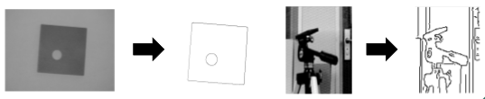 
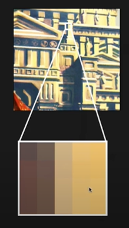 
edges are pixels that lie exactly in between two or more different image regions (can be phisical objects). 
 
 
# 1D Step-Edge 
Sharp chamge of a 1D signal (line). 
Those changes can be detected using (first order) **derivatives**. 
The simplest edge detector uses a static threshold that is compared with the absolute value of the derivative in the given point. If it's over, it's considered as an edge. 
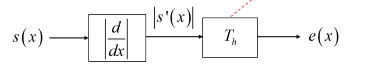 
The absolute values is needed since in 1D the edge can have 2 **directions**: 
- Low to High (positive derivative) 
- High to Low (negative derivative) 
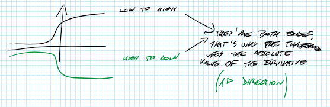 
# 2D Step-Edge 
Images are in 2D, so we are interested in 2D edge detection. 
In this case, there are infinite possible directions: 
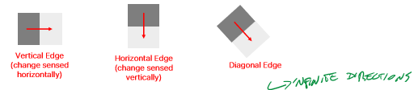 
In this case, the **gradient** is used (vector of the two partial derivatives). 
Gradient's direction corresponds to the edge's direction. Again, a threshold is used. 
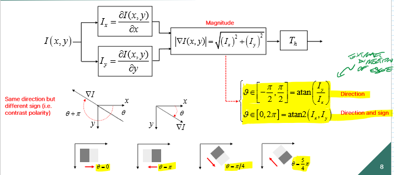 
 
## Discrete gradient approximation 
Since pixel values are discrete, the following approximation eases the work: 
We can use both backward and forward differences (both on x or y axes): 
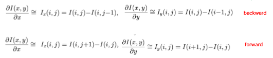 
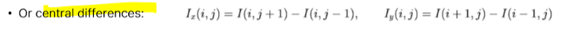 
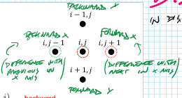 
The **magnitude** can be estimated with different kind of norms, but the best is the **inf norm**. This is because it is **invariant with respect to edge direction** (as seen on table below). 
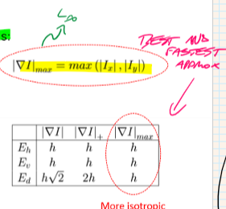 
# Noise 
Real images have noisy edges: 
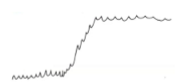 
The problem is that **derivatives amplify Noise** 
Thus, the edge detector must be **robust to Image Noise**  
A solution could be applying denoising techniques before edge detection, but blurring the images makes the detection much more difficult (also blurs edges). 
### Difference of averages 
Another solution is **difference of averages**, rather than averaging the image first and then computing the differences. 
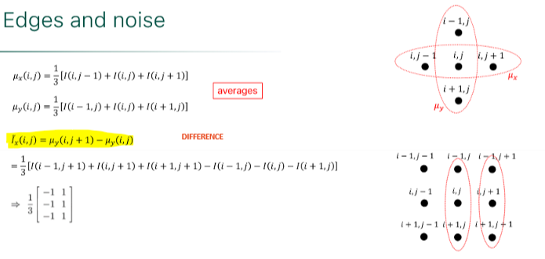 
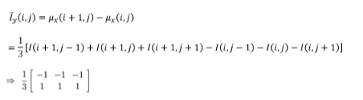 
# Prewitt and Sobel 
The Prewitt operator allows to use difference of averages with central differences, while the Sobel operator allows to weight more the central pixel. 
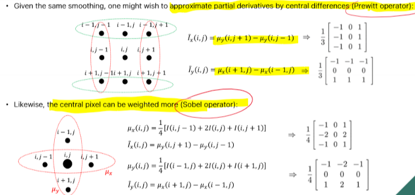 
 
 
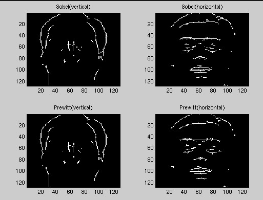