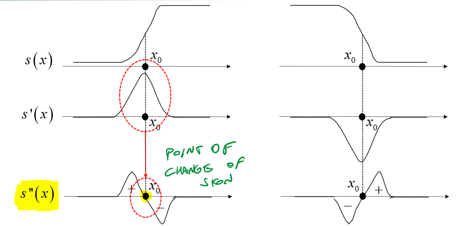
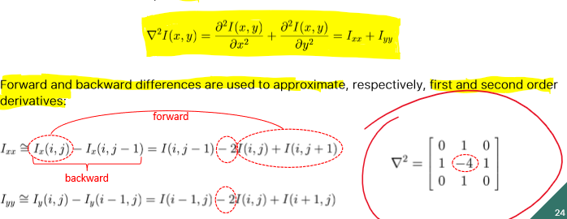
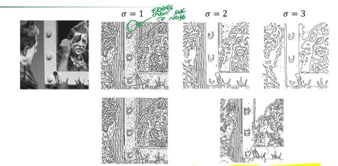

_instead of using first order derivatives, another effective way to extract edges in Edge Detection, is using **second order derivatives** and the **Laplacian operator**._ 
# Zero Crossing 
Instead of searching the peak of the 1st derivative, we now look for the zero crossing point of the 2nd. 
 
## Laplacian 
As second order derivative operator, we can use the Laplacian: 
 
# LOG 
LOG simply consist in applying a Gaussian filter BEFORE applying the Laplacian kernel to find zero-crossing points. In order, the operations are: 
1. applying Gaussian Filter 
2. applying Laplacian kernel 
3. extracting zero crossing points (the edges) 
 
Thanks to Gaussian Filter#Separability, LoG can be applied with four 1D convolutions, which makes the computations easier than applying a two 2D convolution, with a speed up of $\frac{1}{2}K$, where K is the dimension of the Gaussian kernel: $\nabla(I(x,y)*G(x,y))=I(x,y)*\nabla G(x,y)$ 
which becomes: $$(I(x,y)*G''(x))*G(y) + (I(x,y)*G''(y))*G(x)$$ 
Ideally, the Laplacian operator would return something like this: $[-10, 0, 20]$, where 0 is the zero-crossing point. This does not actually happen, so we get something like $[-10, 20]$. In this case, the pixel closest to zero is chosen as edge candidate (-10 in the previous example). 
 
## Example 
 
note: the higher the $\sigma$ of the Gaussian filter, the fewer edges are detected. 
Overall, it's still best to apply a small sigma (just for denoising), and then apply a threshold to filter out irrelevant edges.