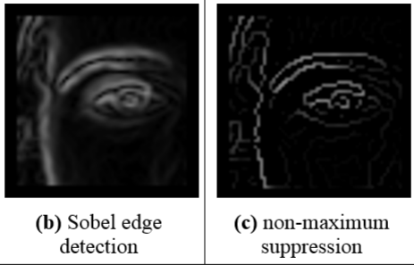
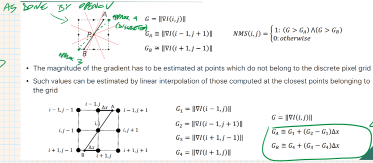
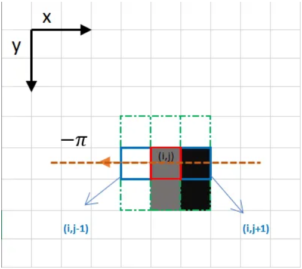

 
- finding the local maxima of the absolute value of the derivative. 
- Looking along the gradient direction 
-   If pixels are not part of the local maxima (along the direction), they are set to zero (aka black) 
-   This has the effect of suppressing all image information that is not part of local maxima. 
-   The reason is to thin out the edges and reduce noise in the image. 
-   This helps to make the edges more distinct and easier to detect. 
 
## Direction discretization 
In fact the correct direction needs to be estimated locally based on gradient's direction. 
But the gradient is continuous, and our domain is made of discrete pixels -> need discretization (of the direction): 
 
The actual magnitude at a direction not present in the discretized pixel grid is computed using a **linear interpolation**, to get more accurate results.  
 
Applying magnitude thresholding AFTER NMS helps in filtering out irrelevant edges (due to noise or not important details) 
 
 
## Example 
Usually NMS is performed considering a 3x3 neighborhood window. 
 
Considering the point $(i,j)$, whose direction is $-\pi$, the pixel with highest intensity between the neighborhood (i,j-1), (i,j) and (i,j+1) is (i,j-1). 
We thus set (i,j) to black (value 0).