_Algorithms that detect Local Invariant Feature points._ 
## Moravec Interesting Point Detector 
_**cornerness** of a pixel p is a measure of the likelihood of that point being a corner:_ 
$$C(p)=min_{q\in neigh(p)} ||N(p)-N(q)||^{2}$$ 
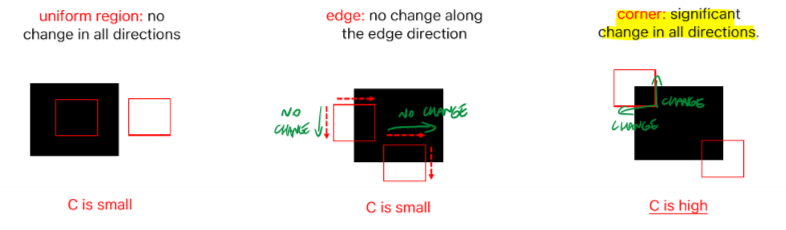 
If this number is sufficiently high, it means that on every neighboring direction the change is high, meaning that the point p is a corner. 
## Harris Corner Detector 
Continuous formulation of #Moravec Interesting Point Detector: 
shifting the image on infinitesimal scale ($\Delta x , \Delta y$), being able to deploy Taylor's expansion at (x,y): $$f(x+\Delta x)=f(x)+f'(x)\Delta x$$ 
 
_(we only need the first degree approximation)_ 
 
so the 2D image with infinitesimal shift is written as: $$I(x+\Delta x, y+ \Delta y)= I(x,y)+I_{x}\Delta x + I_{y}\Delta y$$ 
We consider a window function (usually of +size 1): $w(x,y)$ which is 1 inside the window, 0 outside 
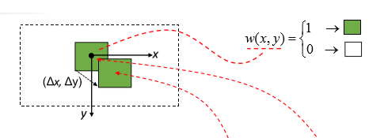 
In the end you end up with a weighted sum of derivatives: 
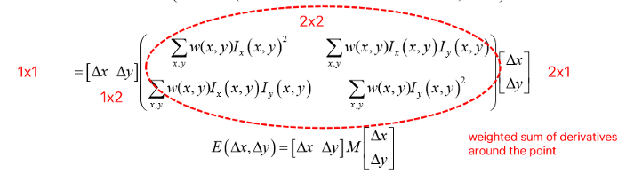 
This matrix M encodes the local image structure around the pixel p. If M is a diagonal matrix, it becomes the **matrix of eigenvalues**: 
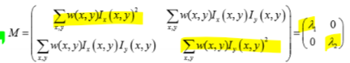 
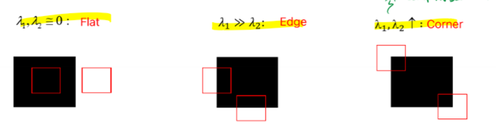 
 
But M can always be diagonalized with rotations: 
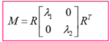 
That's why this method is **invariant to rotations.** 
 
Computing eigenvalues for every pixel is very expensive though, so a better solution is using an approximation that exploits determinant and trace. 
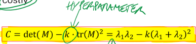 
## Steps 
Harris Corner Detector follow usually 3 steps: 
 
**1. Compute C for each pixel** 
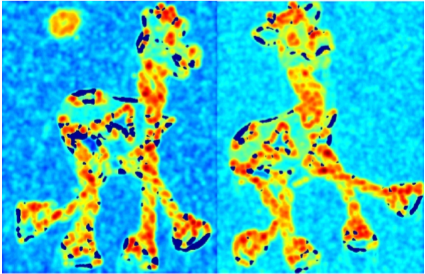 
**2. Select only pixels where C is higher than a threshold T** 
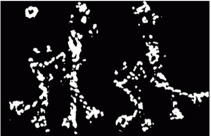 
**3. Detect as corners only those pixels that are _local maxima of C_** 
using Non-Maxima Suppression (NMS) 
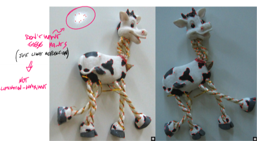 
### Properties 
- **Rotation invariant** 
- **NOT** illumination invariant (as seen above) 
- **NOT** scale invariant, since the neighboring window is fixed (usually 1, thus it's detailed) 
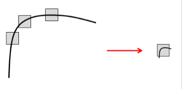 
 
# Scale-Space 
Depending on distance and focal-length, objects may appear differently in the image, and may exhibit less/more details (features). 
Scaling changes the amount of features detectable 
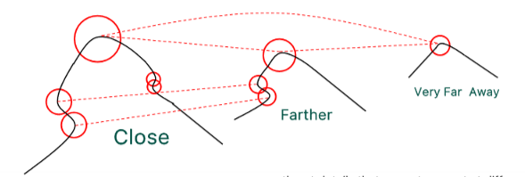 
Solution: applying a fixed-sized tool on different scaled and blurrier versions of the same image -> "SCALE SPACE" 
The blurrier the image, means the bigger the feature detected is. The more detailed the image, it means that the features is small, since it was filtered out in the other layers of the scale space. 
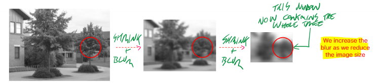 
Scale space must be realized with Gaussian Filter smoothing: 
$L(x,y,\sigma)=G(x,y,\sigma)*I(x,y)$, increasing the kernel size when shrinking the image. 
 
# Scale-Normalized LOG 
_Useful for detecting **Local Invariant Feature#Blob features** in images. 
Uses the scale-normalized Laplacian of Gaussian (LOG), which uses second order derivatives._ 
Convolves image with LOG filter at multiple scales: 
$F(x,y,\sigma)=\sigma^{2}(\nabla^{2}G(x,y,\sigma)*I(x,y))$  
the $\sigma^{2}$ does normalization, making the filter invariant to scale changes.  
 
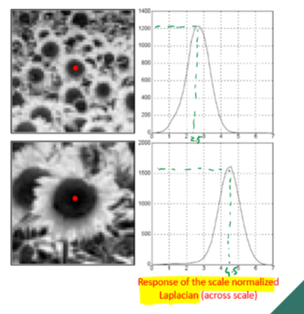 
The idea is to find extrema (min, max) across x, y, $\sigma$. because these points correspond to regions of the image that have **high curvature or intensity variation in multiple directions** (detected by 2nd derivative) -> **BLOBS** 
 
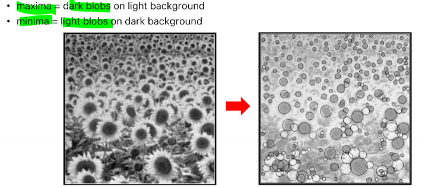 
We can see from the different sizes of the circles, that the **detected blobs are associated to different scales.** 
# Difference of Gaussian (DoG) 
$DoG(x,y,\sigma)=L(x,y,k\sigma)-L(x, y, \sigma)$  
Where **k** is a constant Hyperparameter, which **controls the scale** of the filter. 
It is a difference of smoothed images, where $\sigma$ of the Gaussian Filter slightly changes. 
 
It gives similar result to #Scale-Normalized LOG, but it's more efficient (**approximation**) 
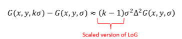 
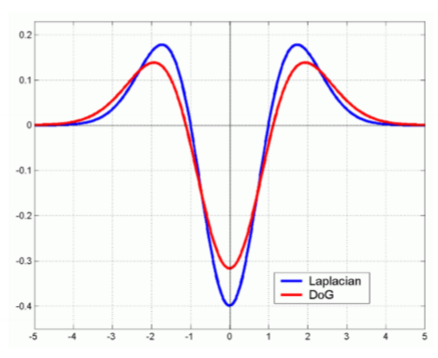 
Can also detect blob-like features.