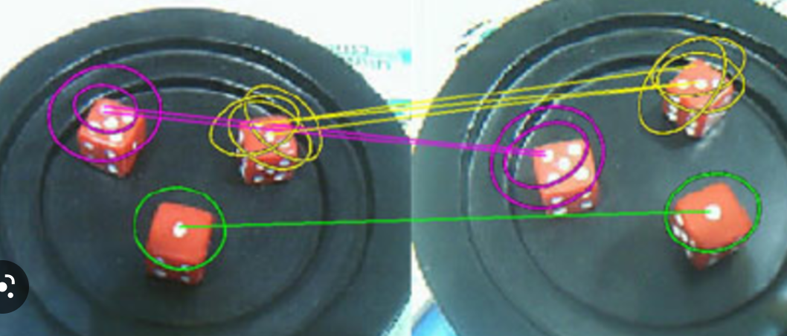
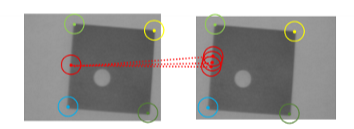
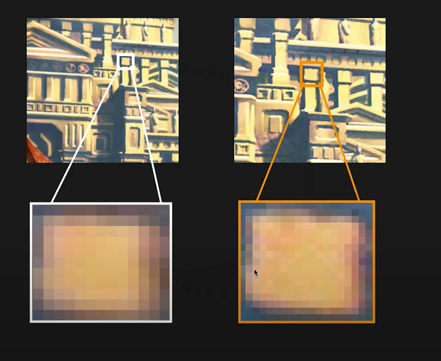

_**An image pattern which differs from its immediate neighborhood**, aka keypoint. 
Detecting those features is an Image Processing task._ 
 
Finding Correspondence points between 2 or more images is crucial in Pinhole Camera model#Stereo correspondence, to estimate depth in images, but also for many other applications in Computer Vision, such as Panorama Stitching (need 4 corr. points), object detection, AR, robot navigation and odometry (SLAM), 3D reconstruction, and many more. 
 
# Paradigm 
There are 3 main steps and components: 
1. **Detector** -> finds **salient points** (aka feature points or keypoints) 
	- **Repeatability**: should find same keypoints in different views, despite any transformation 
	- **Salience**: find keypoints surrounded by informative patterns (more discriminative when matching) 
2. **SIFT#Descriptor** -> computes a **descriptor**, based on neighbor pixels.  
	- **invariant** to any type of transformation.  
	- **Distinctiveness vs Robustness**: description algorithm should capture salient information, and disregard changes due to noise or light. 
	- **Compactness**: concise descriptions (minimize memory, efficient matching) 
3. **Matching** -> descriptors between images 
 
# Interesting Points 
 
## Corners 
Edges can be hardly told apart since they look very similar along the direction of the gradient. 
Pixels having large variations along **all directions** are more distinguishable, hence better for matching -> CORNERS 
 
## Blob 
Corners are indeed good interesting points, but they don't show up much often in images, and they're not very unique. We need another kind of features: blobs. 
 
They also have the very useful property to be fixed in position and definite in size.