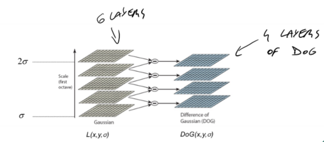
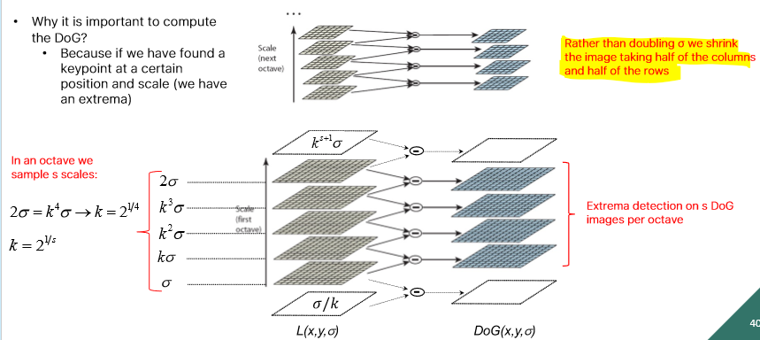
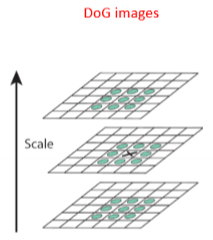
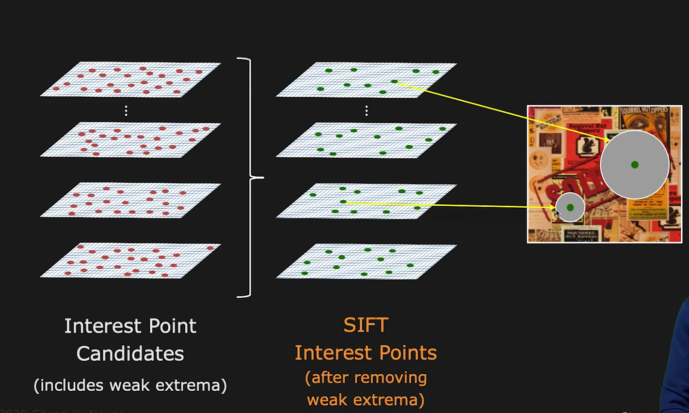
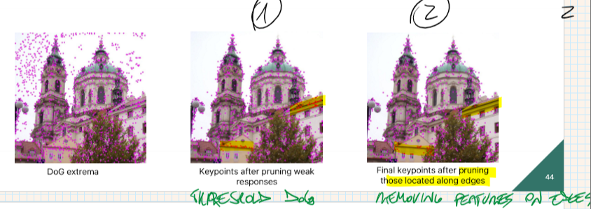
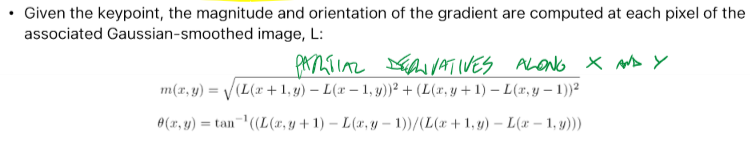
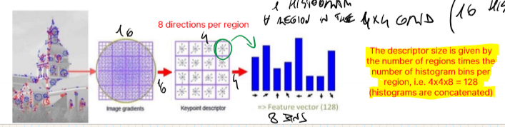
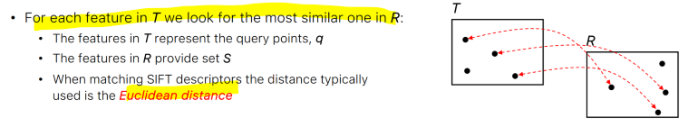

_Stands for "Scale Invariant Feature Transform" **invariant to image scaling, translation, and rotation** (canonical orientation) and partially invariant to illumination changes and affine or 3D projection._ 
# Detector 
Based on the DoG formula: $$DoG(x,y,\sigma)=L(x,y,k\sigma)-L(x, y, \sigma)=(G(x,y,k\sigma)-G(x,y,\sigma))*I(x,y)$$makes a scale space of the image with different $\sigma$ for the Gaussian kernels (within an octave). In an octave, we sample $s$ scales: $$2\sigma=k^{s}\sigma \rightarrow k=2^{\frac{1}{s}}$$Between each pair of layer, difference is performed, obtaining multiple  Detector#Difference of Gaussian (DoG) layers: 
 
(two additive layers are added on top and bottom of scale space to have more DoG layers) 
 
In each octave the size is the same, and shrinks in the successive one: 
 
 
We now look for extremas in each of the DoG layer, comparing with neighborhood, both on same layer, and on upper and lower layers 
 
The layer of the detected extremas define the **scale** of the blob feature: the blurrier the image, the bigger the feature!  
 
 
### Thresholds 
After finding the extremas, 2 thresholds are applied: 
1. 1st removes useless points (for example in the background) 
2. 2nd removes features along edges (useless since we can use Edge Detection) 
 
- **Hyperparameter#Tuning**: 
	according to Lowe, the best values are $s=3$ and $\sigma=1.6$ 
 
# Descriptor 
**local feature descriptor** that is computed for each keypoint detected by the SIFT Detector. 
More specifically, a 16x16 neighborhood patch is considered. 
This kind of descriptor, based on orientation, is biologically inspired from the Complex cells in the Primary Visual cortex (Visual cortex#V1#Simple and Complex cells) 
 
## Canonical orientation  
_"By assigning a consistent orientation to each keypoint based on local image properties, the keypoint descriptor can be represented relative to this orientation and therefore achieve invariance to image rotation"_ 
magnitude and orientations are computed for each pixel using partial derivatives (with **central differences**). 
 
Then build an **orientation histogram** for each keypoint (considering a neighboring window whose size depends on the keypoint size). Taking into account the direction and magnitude of each neighboring pixels (weighted by a 2D Gaussian), with a bin size of 10°, we count the occurrences of the orientations and build the histogram. 
The **characteristic orientation** is the highest peak of the histogram (and the other 80% highest values) 
 
## SIFT Descriptor 
Given m(x,y) and $\theta(x,y)$ for each pixel:  
- A 16x16 neighborhood patch is considered for every keypoint.  
- Divided into 16 regions (4x4) 
- A **gradient histogram** is created for each of those region 
- Each histogram has 8 bins. 
- pixels contribute to histogram according to: 
	- Gradient magnitude 
	- Gaussian weighting function 
 
Finally, to avoid **boundary effects**, a **trilinear interpolation** scheme is applied: the contribution of two adjacent bins is weighted by distance of the bin center (done also between different regions). 
Descriptor is **normalized** to be more robust to intensity variations (i.e. light) 
 
# Matching 
Can be used for **object recognition, image stitching, 3D modeling, gesture recognition, video tracking**, and other applications. 
Comparing descriptors from 2 different images (different views) of the same scene/object, to find corresponding keypoints. 
All the invariance properties are needed to have reliable matching across all kind of variable domains (for light, rotation and scale). 
 
SIFT descriptors are compared to find corresponding keypoints, using **Nearest Neighbor (KNN) Search** and **Euclidean Distance**.  
 
Distance is computed for each keypoint in T, and we count as matches the ones where $$\frac{d_nn}{d_{2-nn}}\le T $$  
_("Lowe's Ratio")_ 
 
Where T is a threshold of 0.8 (empirically the best value to reject 90% of wrong matches and miss 5% of right matches). 
$d_{2-nn}$ is the distance of the neighbor's neighbor. This works best since real matches also have near neighbors with small distances. 
 
### Efficient search 
This search method is computationally expensive. Faster alternatives are: 
- **k-d tree** -> uses a kind of binary tree search 
- **Best Bin First (BBF)** -> efficient in high dimensional spaces 
 
