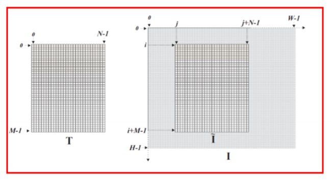
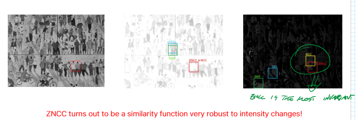
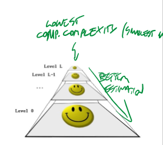
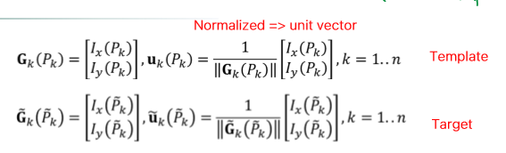
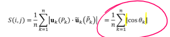
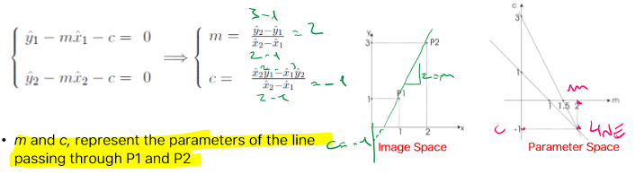
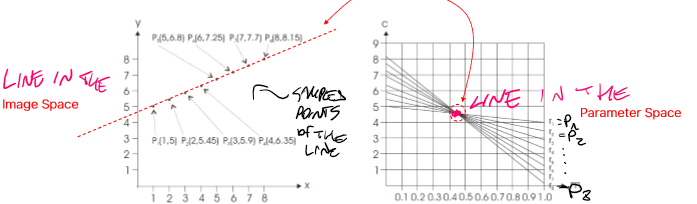
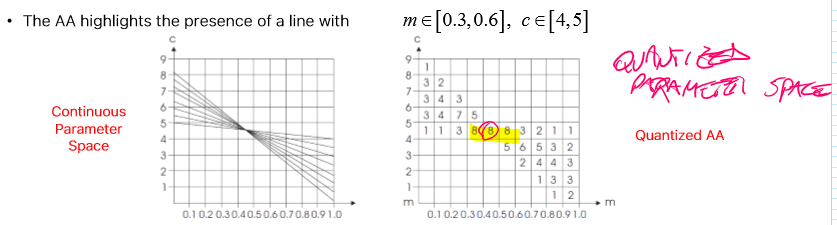

_ Given a **template image** of a specific **instance object**, determine if it is present in the **target image** under analysis. In case of detection, also estimate the pose._ 
The pose can be: 
- Translation 
- Roto-translation 
- Similarity (roto-translation + scaling) 
 
Other nuisances to be dealt with are intensity changes, occlusions, and clutter. 
There are different methods that can be applied. 
 
# Template matching 
Model image is slid across target image to be compared at each position to an equally sized window. **Based on similarity functions.** 
It's a slow technique: $O(MN \cdot WH)$ -> size of template (MN) $\cdot$ size of target (WH) 
 
 
## Similarity functions 
The matching is performed according to similarity functions, that compute how much the current grid is dissimilar to the template. 
 
Left: template grid -> size MN 
Right: template grid sliding onto the Image -> size HW.  
(i,j) is top left pixel corner coordinates of target grid 
 
- **Sum of Squared Differences:** $$SSD(i,j)=\sum_{m=0}^{M-1} \sum_{n=0}^{N-1}(I(i+m,j+n)-T(m,n))^2$$ 
- **Sum of Absolute Differences:** $$SAD(i,j)=\sum_{m=0}^{M-1} \sum_{n=0}^{N-1}|I(i+m,j+n)-T(m,n)|$$ 
Normalization is essential, since change in intensity would mess up the matching process (a bright area would have high correlation than the actual target just for the intensity) 
- **Normalized Cross Correlation:** $$NCC(i,j)=\frac{\sum_{m=0}^{M-1} \sum_{n=0}^{N-1}I(i+m,j+n)\cdot T(m,n)}{\sqrt{\sum_{m=0}^{M-1} \sum_{n=0}^{N-1}I(i+m,j+n)^{2}} \cdot \sqrt{\sum_{m=0}^{M-1} \sum_{n=0}^{N-1}T(m,n)^{2}}}$$ 
	It is invariant to linear intensity changes 
- **Zero-mean Normalize Cross correlation:**  
	It is invariant to affine intensity changes (linear + bias) 
	First we compute the means: $$\mu(\tilde I)=\frac{1}{MN} \sum_{m=0}^{M-1} \sum_{n=0}^{N-1} I(i+m, j+n)$$ 
	$$\mu(T)=\frac{1}{MN} \sum_{m=0}^{M-1} \sum_{n=0}^{N-1} T(m,n)$$ 
Then the ZNCC is just the NCC there those means are subtracted 
	$$ZNCC(i,j)=\frac{\sum_{m=0}^{M-1} \sum_{n=0}^{N-1}(I(i+m,j+n)-\mu(\tilde I)) (T(m,n)-\mu(T))}{\sqrt{\sum_{m=0}^{M-1} \sum_{n=0}^{N-1}(I(i+m,j+n)-\mu(\tilde I))^{2}} \cdot \sqrt{\sum_{m=0}^{M-1} \sum_{n=0}^{N-1}(T(m,n)-\mu(T))^{2}}}$$ 
It's invariant to affine intensity changes: $\tilde I(i,j)=\alpha \cdot T + \beta$ 
 
 
 
## Fast template matching 
To speed up the slow template matching, we can use an image pyramid, similar to the Detector#Scale-Space. 
Each level is a smoothed and sub-sampled 
 
Full search at top (smallest) level, then local refinements traversing down the pyramid. 
 
# Shape-based Matching 
**Edge-based** #Template matching approach. 
1) A set of **control points $P_k$** is extracted from the model image by an edge detector, also gradient direction is computed and stored for each $P_k$. 
2) At each position $(i,j)$ of the target image, the recorded gradient directions associated with control points are compared to their corresponding image points $\tilde P_{k}(i,j)$ to compute a similarity function. 
 
**Edge detection is only computed on the target (once).** 
So basically the comparison is done between control points, which lays on edges. 
### Similarity functions for shape-based matching 
 
This one uses cosine similarity  
 
 
# Hough Transform 
Detects objects with shapes that can be expressed by an equation, based on projection of the input into **Hough space** (or parameter space). 
- It's applied after Edge Detection.  
- Robust to noise, and partially to occlusion. 
- Generalized Hough Transform -> advanced version that recognizes any shape 
 
### Hough space 
Given the linear equation $y-mx-c=0$, one can fix y and x (instead of m and c), and find all possible lines through the specific fixed point at $(x,y)$. 
If we consider the intercepting line between two points $P_1$ and $P_2$ in parameter space, we end up with two lines in Hough space that intercept in one point, which represents the image line through $P_1$ and $P_2$. 
 
Moreover, given n colinear image points in image space, projected in Hough space, the all the lines will merge in a single point 
 
**Therefore, rather than looking at extended shapes in images, we look for interceptions in the parameter space of lines!** 
 
Below, an example where we got blue points from the same orange line, and a green point that does not belong to it. Its line in Hough space does not pass through the orange point. 
 
### Implementation 
The actual Hough space needs to be quantized and allocated as a matrix, known as the **Accumulator Array (AA) 
 
 
 
