_Process whereby all parameters defining the Image formation#Complete camera model are estimated for a **specific camera device**_. 
 
## Calibration patterns 
Checkerboard patterns useful for being easy to process. 
Two categories: 
- Single image of a 3D calibration object 
- Multiple images of the same planar pattern (different orientations) 
We know **number of internal corners** (has to be odd in one side for rotation ambiguities) and **size of each square** (cm). 
 
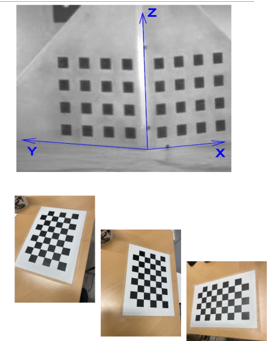 
 
# Zhang's method 
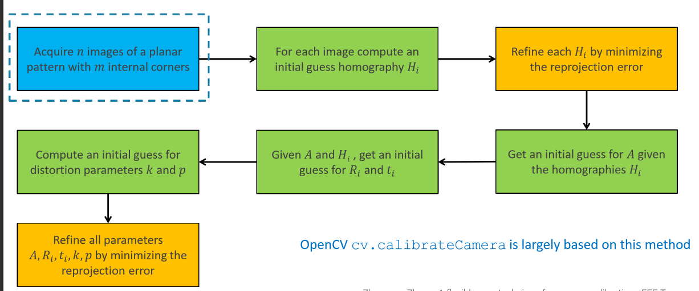 
### World Reference Frame 
The WRF can be defined on the calibration pattern as follows: 
- origin on the same corner (e.g. top left one) 
- X=shorter side 
- Y=longer side 
- Z=0 (planar image), direction perpendicular to X and Y. 
Given these reference coordinates, we can define 3D coordinates for any point of the plane. 
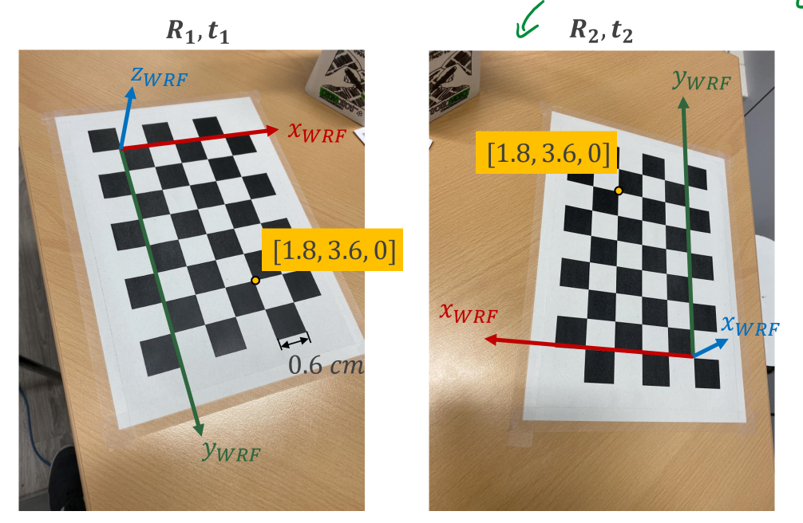 
WRF is different for each calibration image. We estimate as many extrinsic matrices as the number of images used for calibration. 
 
## Homography 
We consider only 3D points with z=0. For this reason we can remove a column from the PPM matrix (so it becomes 3x3): 
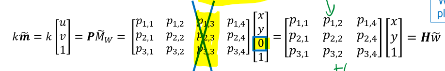 
The **H matrix** is known as **homography** (simplification of P). 
 
Given a pattern with m corners, we can write 3 linear equations for each corner j. 
We know already 2D and 3D cooridinates, but the unknowns are the 9 variables in $H_{i}$ of the i-th image $(p_{1,1}, ... , p_{3,4})$. 
H* is a point in projection space that lies on the same line of $\tilde m_j$, meaning that the are parallel, hence $\tilde m_{j}\times H\tilde w_j=0$.  
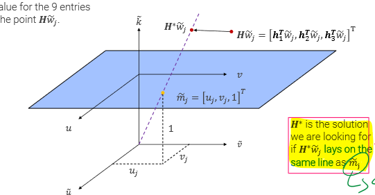 
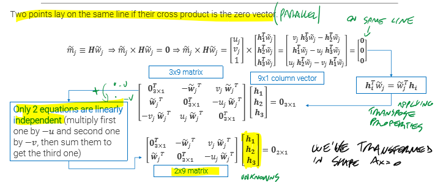 
We get this linear system of equations for all $w_1, ..., w_m$: 
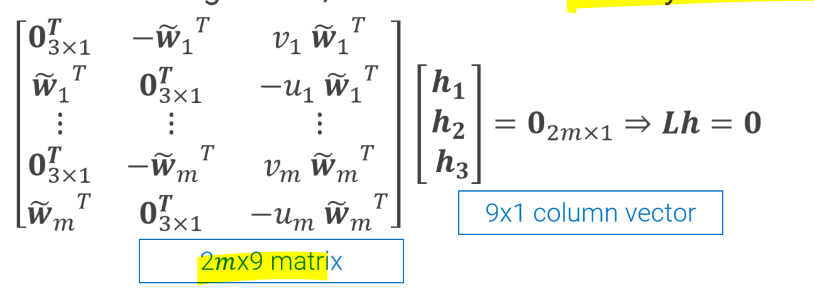 
To remove the trivial (useless) solution with h=0, we also impose that $||h||=1$. 
Solution h* is found by minimizing the norm of Lh.  
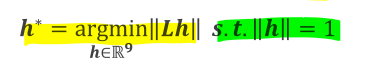 
This is a **least squares problem**, solvable with **Singular Value Decomposition (SVD)** 
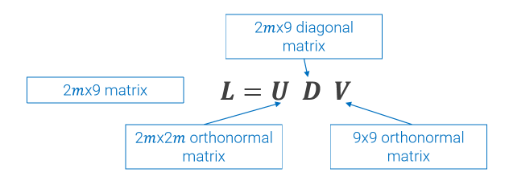 
h* is the matrix V (orthonormal), more precisely its last column. 
 
### Refining H  
H at this point is just an approximation. In fact the projection of the corner $H_{i}w_{j}$ won't probably concide with the real corner point $m_{j}$ -> **geometric error** 
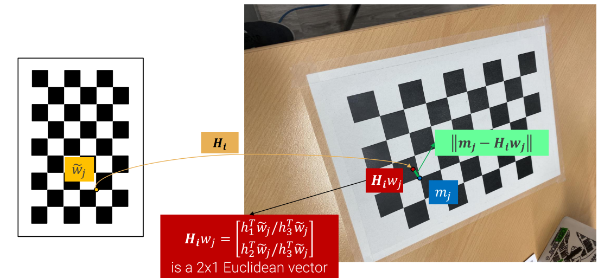 
Using the distance (error) between those two, we can get a better approximation for $H_{i}$. 
This is an iterative minimization problem: 
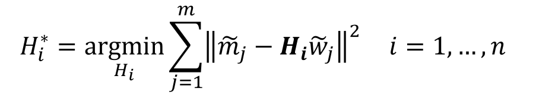 
We take $H_{i}$ as a first guess value, then using a method similar to SGD and Newton's method, we iteratively try to minimize the distance for all corners in the image i. 
 
## Estimatic Intrinsic parameters (A) 
All images share the same intrinsic parameters. 
At this point we have a fairly good approximation of H for every image. 
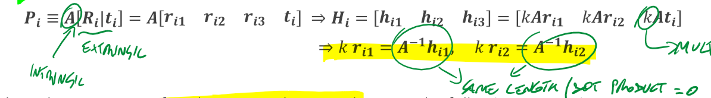 
Since they have the same length, the dot product is zero. Hence we can write 
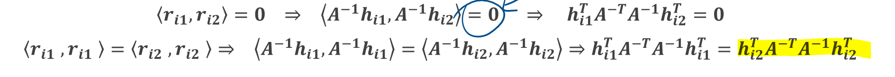 
By solving these constraint for each image, we get a homogeneous sistem of equations with many equation as much as images. 
This can be solved again by **SVD** (that's why we need more than 3 images) 
 
## Estimating Extrinsic parameters (R and t) 
$R_{i}$ and $t_{i}$ are different for each image. Given A and H, we can compute them as follows: 
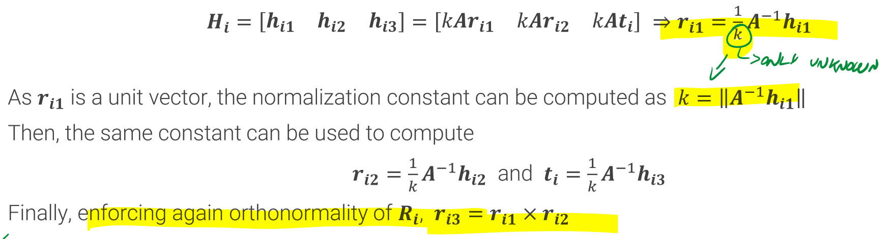 
Though R will not be orthonormal since this is an approximation. 
To get an orthonormal R, we use again SVD, sobstituting D ($\Sigma$) with the identity matrix I. 
 
## Distorsion parameters (k1, k2 and p) 
The coordinates predicted by the Homography H correspond to the undistorted image ($m_{undist})$, so we should consider the non-linear effect of Image formation#Lens distortion, thus estimating the two parameters $k_{1}$ and $k_{2}$ of radial distortion. 
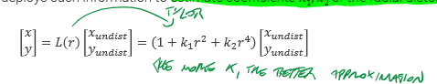 
 
To do this, we need to go back to metric image coordinates (continuous): 
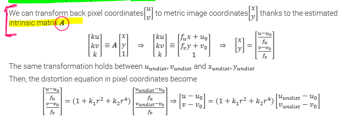 
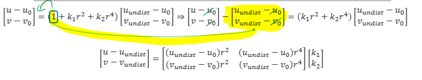 
We thus get a non-homogeneous system of linear equations $Dk=d$ in the unknowns $k=[k_{1},k_{2}]^{T}$. This can be solved as a least-squares problem, minimizing $||Dk-d||_{2}$ exploiting the pseudoinverse of D: 
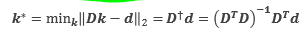 
 
## Refinement of all parameters 
We now have all the parameters, but there still might be some algebraic error . 
To refine and align our final results, we use Maximum Likelyhood Estimator (MLE), using the current param values as initial guesses. 
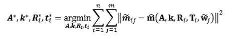