_A more realistic mathematical model than the Pinhole Camera model, useful for Camera calibration_ 
# From 3D to 2D 
The 3D **World Reference Model (WRF)** has to be projected in the **Camera Reference Model (CRF)**, and then in a 2D plane (the image plane). 
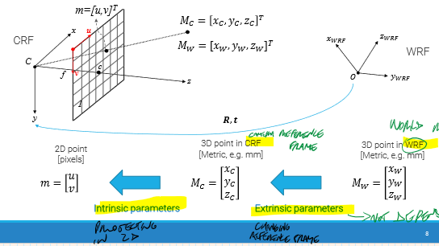 
## Extrinsic parameters 
To pass from WRF to CRF we need to change the origin, performing **rototranslation**. 
6 PARAMETERS NEEDED: 
- 3 for translation 
- 3 for rotation (they are actually 9, but only 3 are linearly independent) 
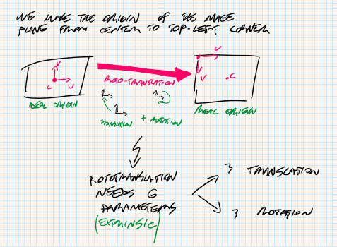 
## Intrinsic parameters 
4 PARAMETERS NEEDED: 
$f_{u}=\frac{f}{\Delta u}$, $f_{v}=\frac{f}{\Delta v}$, $u_0$ and $v_0$ -> **camera geometry**. 
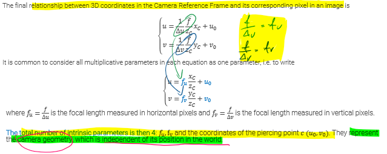 
 
# Projective space 
The final model is non-linear: 
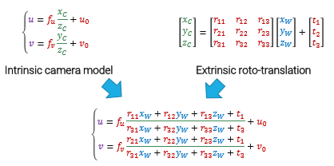 
We can make it linear by considering a virtual **Projective space**, equivalent of the euclidean space of the WRF. 
 
The generic vector $[x, y, z] ∈ R^{3}$ becomes $[x, y, z, 1] ∈ P^{3}$ , i.e. a fourth dimension is added to the vector. Moreover, the new vector can be multiplied by a constant k 6= 0 and can still represent the same original point from $R^{3}$ . In general, if a n-dimensional projective space vector is given, this will just be represented as a vector of n + 1 elements: $[x1, x2, . . . , xn+1]$.  
To shift from P3 to R3 it is necessary to divide every element by xn+1 (to get the 1 in the additional dimension) and than remove the last dimension. 
In projective space, points are represented as lines. This allows the representation of points at infinity, i.e. when xn+1 = 0, while in R3 this is not possible. 
### Intrinsic parametric matrix 
We can rewrite the linear equation of the intrinsic parameters in matrix form in projective space, as follows: 
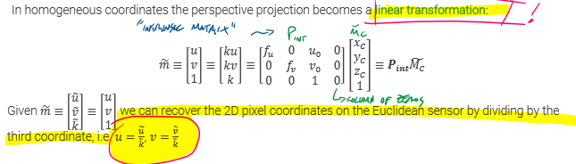 
 
 
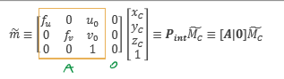 
The left 4x3 matrix $P_{int}$ is called **intrinsic parametric matrix**, often referred as $[A|0]$. 
A is always upper right triangular. 
Realistic models also include a 5th parameter, called **skew**, to take into account non orthogonalities between axes of the sensor. 
 
### Extrinsic parameter matrix 
We just take the already known parameter matrices and project in projective space 
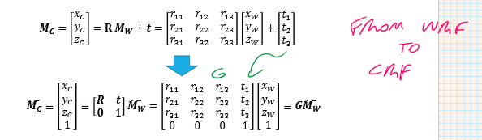 
This matrix is also referred as **G**. 
G is defined by R and t 
 
## Perspective projection matrix 
Getting the two matrices together, we get the PPM, also referred as **P**: 
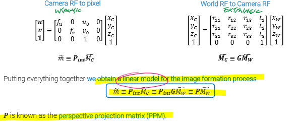 
P is a 3x4 full-rank matrix = $P_{int}G$ 
 
# Lens distortion 
PPM is based on Pinhole Camera model, but real Lenses introduce distortions to it. 
We need to take into account their effect: 
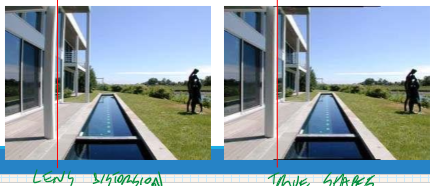 
 
**KINDS OF DISTORTIONS:** 
- **Radial distortion** -> lens curvature (making straight lines curve) 
	- **Barrel distortion** -> straight lines bend outwards ("botte") 
	- **Pincushion distortion** -> straight line bend inwards ("puntaspilli") 
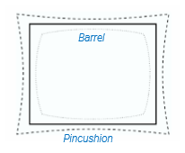 
- **Tangential distortion** -> misalignment and defects of the camera components 
 
Lens distortion is modeled through a non-linear transformation. 
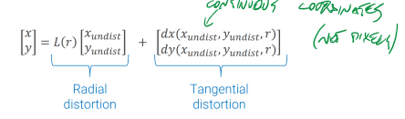 
L(r) is the **radial distortion function**, proportional to the radius r (distance to the center of image in (0,0)). 
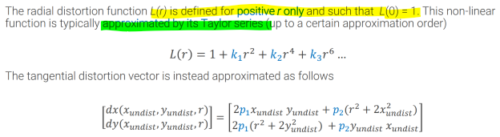 
This adds k new parameters to the complete camera model 
 
# Complete camera model 
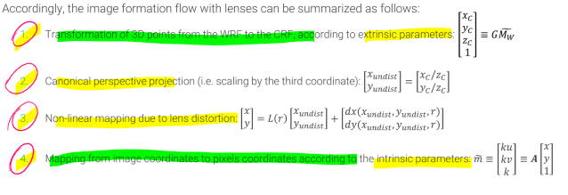