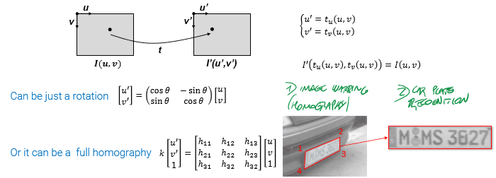
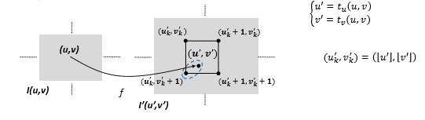
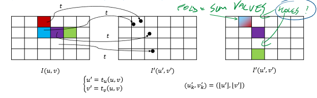
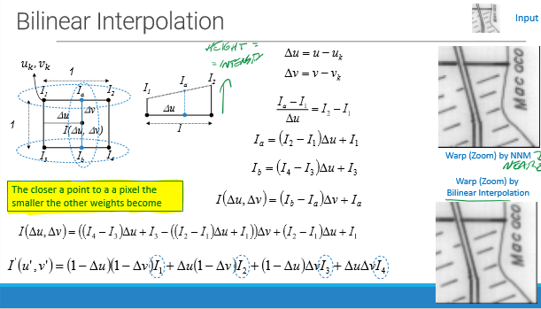
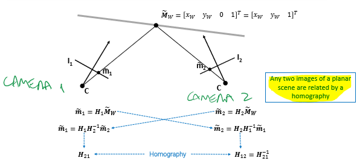
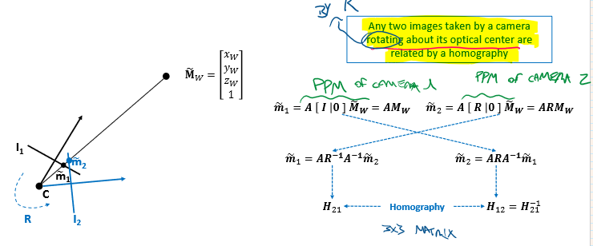
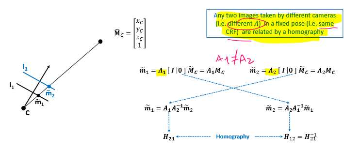

\_After finding all camera parameters with Camera calibration#Zhang's method, we can **warp** the images without worrying of Image formation#Lens distortion._ 
 
After applying warping function we get continuous coordinates. We can apply 
- truncation (easier) 
- nearest neighbor (i.e. rounding) 
 
But regardless of this choice, we may end up with 
- more than one pixel onto the same position -> **folds** 
- some pixels of the destination may not be hit and remain empty -> **holes** 
 
## Backward mapping 
To avoid those problems, we can take a value for each coordinate in the output image by using **inverse mapping**. Coordinates are still continuous, so we can: 
- truncate or nearest neighbor (as before) 
- **interpolate** between the 4 closest points (bilinear, bicubic, ...) 
 
# Stereo homographies 
In the case of multiple cameras in Pinhole Camera model#Stereo Geometry, the two (or more) images are related by an homography: 
 
This is also valid for a single camera, when we have multiple images of the same object but rotated, A is fixed and $[R,t]$ change 
 
Or if we take two exact photos in the same pose, but with two different cameras, $[R,t]$ are fixed and A changes: 
 
If we change both A and $[R,t]$, we end up with the first scenario above. 
 
This allows us to rectify two images  (Pinhole Camera model#Epipolar Geometry and Rectification), for the purpose of stereo matching (Pinhole Camera model#Stereo matching), by aligning intrinsic and extrinsic parameters.