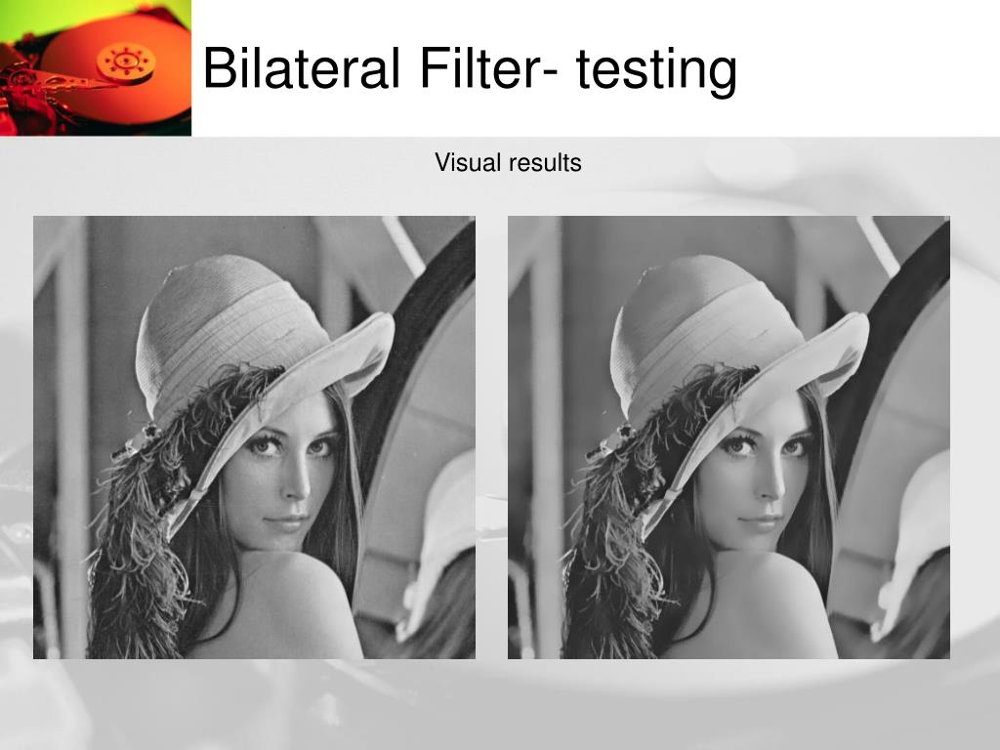
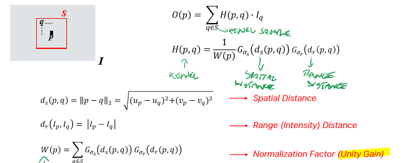
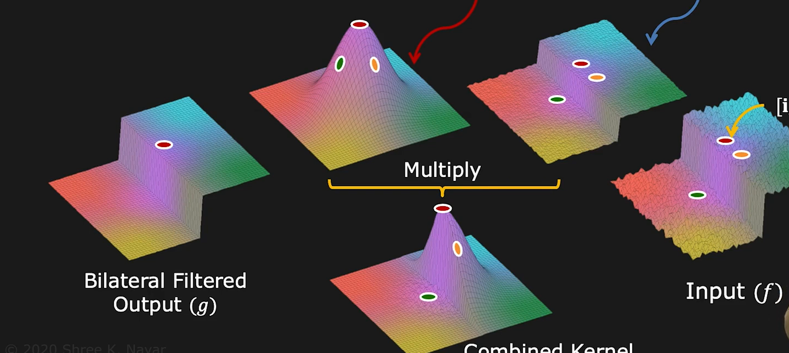

_AKA "edge preserving smoothing" 
**Non-linear** filter that effectively denoises Image Noise#Gaussian Noise without blurring, **preserving edges**._ 
 

- Bilateral filter is highly effective at **noise removal** while **preserving edges**. 
- The operation is **slower** compared to linear filters. 
- **Gaussian filters** is a function of **space** alone and does not consider whether pixels have almost the same intensity value or not resulting in blurred edges. 
- The **bilateral filter** also uses a **Gaussian filter** in the **space** domain, but it also uses one more (multiplicative) **Gaussian filter** component which is a function of **pixel intensity differences**.  
- As a result, this method preserves edges, since for pixels lying near edges, neighboring pixels placed on the other side of the edge, and therefore exhibiting large intensity variations when compared to the central pixel, will not be included for blurring. 
   
   
  In order to do this, it uses **spatial and intensity distances** 
   
- Neighbouring pixels take larger weights as they're both closer and similar to the central pixel. 
- At a central pixel nearby an edge, pixels from the other side look quite different, thus will have much smaller weights 
   

In the image below, red arrow is spatial distance, blue arrow is range distance. 
Multiplying them we get a special edge-aware gaussian filter. 
 
 
Here is the [**VIDEO explanation**](https://www.youtube.com/watch?v=7FP7ndMEfsc)
