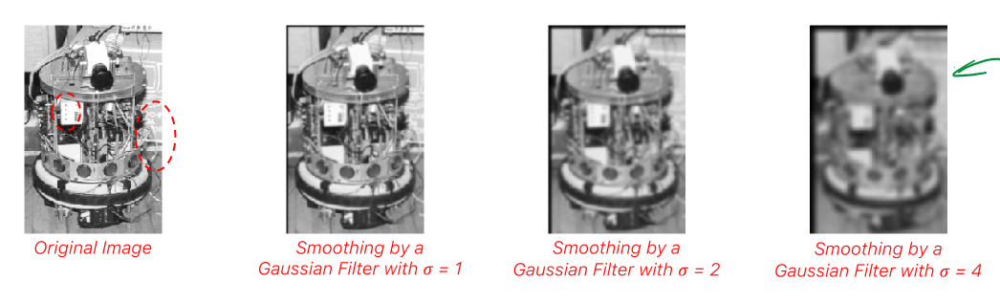
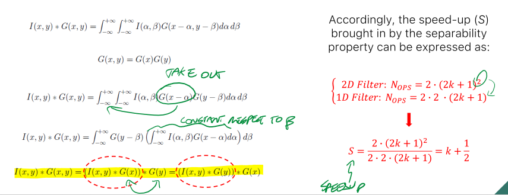

_LTE operator whose kernel has the values of a 2D Gaussian function (with zero mean)._ 
The higher the variance $\sigma$ the stronger the smoothing. 
 
 
As the name suggests, it is effective against Image Noise#Gaussian Noise. 
As $\sigma$ gets larger, the small details will disappear, but larger objects will still be recognizable. 
 
## Implementation 
The gaussian kernel can be obtained by sampling the corresponding continuous function. 
The larger the kernel, the more computations are needed, but the more accurate the sampling. 
Given $\sigma$, the size of the kernel (k) is computed as: $(2k+1)*(2k+1)$ where $k=3\sigma$  
### Separability 
Exploiting the separability property of integrals, and the symmetry of the Gaussian function, we can speed up the process passing from a $k^{2}$ complexity to k  
 
Given the variance $\sigma$, the kernel size will be $(2k+1)*(2k+1)$ where $k=2\sigma$. 
