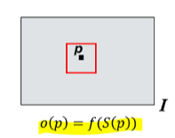
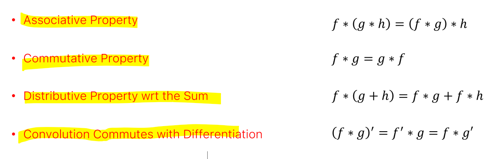
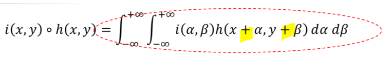
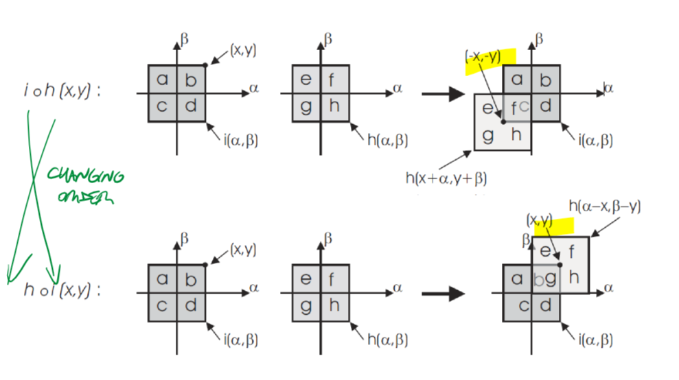
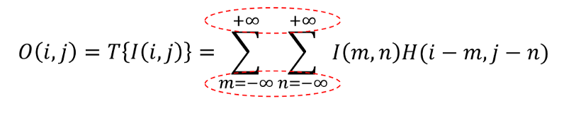
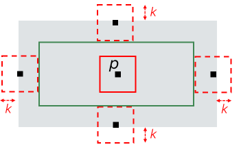

 
_Image processing operators that compute the new intensity of a pixel $p$ based on the intensity of its neighborhood (aka **support**)._ 
# Linear Translation Equivariant (LTE) Operator 
Image Noise#Denoising over space technique, that uses 2D convolutions between the input raw image and a **kernel** (impulse response function). 
 
- A filter is **linear** iff: $$T\{ai_1(x,y)+bi_2(x,y)\}=aT\{i_1\}+bT\{i_2\}$$ 
- A filter is **translation-equivariant** iff: $$T\{i(x-x_{0}, y-y_{0})\}=o(x-x_{0},y-y_{0})$$ 
	In general, it means that the position of an object in an image should not matter during the filtering process. 
## Convolution  
**Linear and Translation equivariant** filters apply a linear operator T to an image i(x,y). 
The output is given by the **convolution** between the input and the **impulse response function (KERNEL)** of the operator T. 
 
It is equivalent to reflect in both axis then translate the kernel. 
 
### Properties of convolution 
 
## Correlation 
Similar to convolution, but there is no reflection. 
 
Its properties are different (NOT commutative) 
 
if h is even, then i * h=h * i =h o i, but still, h o i != i o h (not commutative) 
 
## Discrete convolution 
same as continuous convolution, but with summatories. The same properties still hold.  
 
 
# Practical Implementation 
The kernel has a dimension much smaller than the image. Applying the discrete convolution formula, the kernel will slide across the whole input image to compute the convolution to each pixel. 
What abut edge pixels? Two options: 
- CROP (cut away 4k pixels, k is dimension of kernel) 
 
- PAD (e.g. zero-padding, replicate, reflect, ...), to fill the 4k border pixels with data that will be replaced by convolution. 
 
 
 
