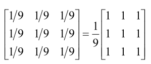

_Linear filter. 
Replaces each pixel intensity by the average intensity of a chosen neighborhood (k neighbors)._ 
Works as a **low-pass filter** (image smoothing) 
 
All the values are the same: $\frac{1}{k}$ 
The bigger the kernel, the smoother (and blurrier) the image, removing Image Noise#Gaussian Noise, but loosing details and edges. 
Mean filters cannot solve **impulse noise**. 
