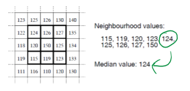
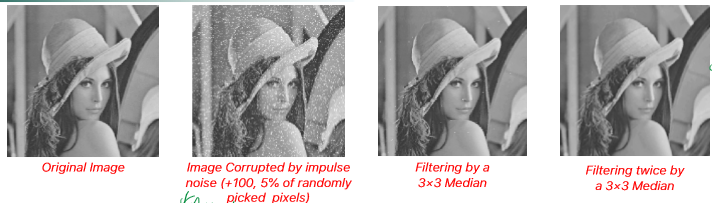

_**non-linear** filter where each pixel intensity is replaced by the **median** over a given neighborhood_ 
 
The kernel is not fixed, and needs to be computed for each pixel (though it is an easy computation) 
It is **very effective** to contrast Image Noise#Impulse Noise, while also preserving sharp edges (**no blurring**) 
 
To remove further the impulse noise, the filter can be applied multiple times. 
It cannot deal with Gaussian noise: The best choice would be to combine them: first using a median and then the Gaussian. 
 
