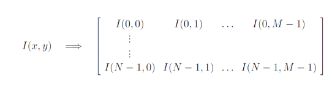
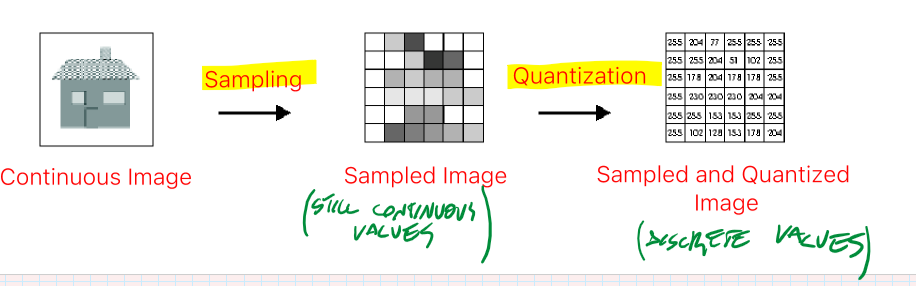
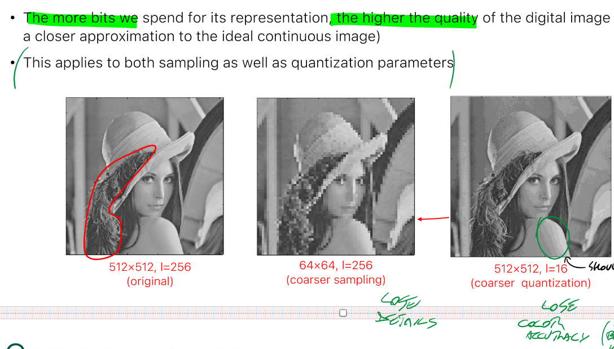
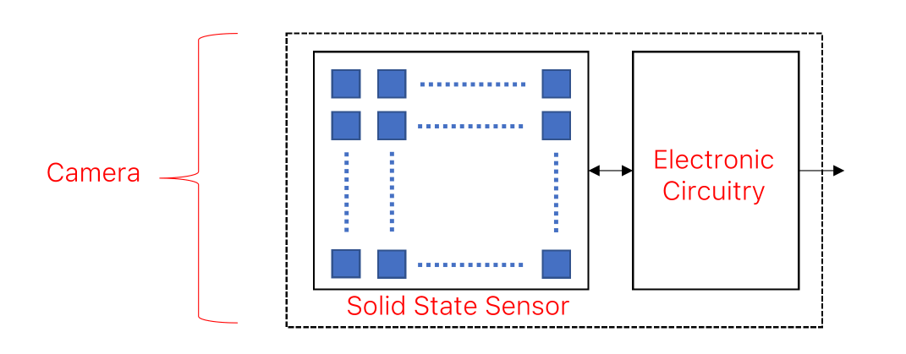
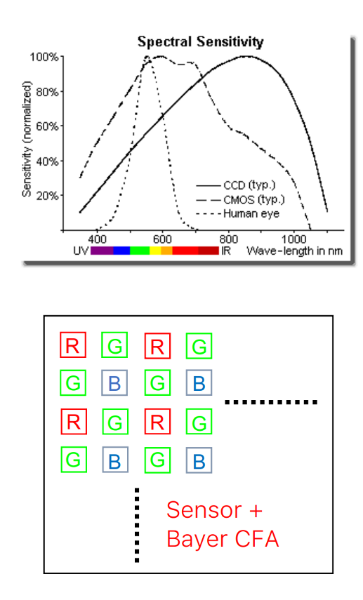
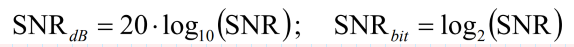

_Process in which the light is turned into discrete electric signals, and the image becomes a tensor of pixels_ 
 
### Steps 
1. **SAMPLING** -> the light sensors convert irradiance into electric quantity 
	The planar _continuous_ image is sampled into both axis to a 2D matrix (NxM), but with continues values (discretization of space) 
 
 
2. **QUANTIZATION** -> the electric values are quantized into $2^{m}$ discrete values. m is the number of bits used to represent a pixel. The final size will be NxMxm (discretization of values) 
 
 
 
# Camera Sensors 
Pinhole Camera models are made of 2D arrays of **photodetectors**. During exposure, the light is converted into electric charge. Digital cameras have ADC circuit integrated. 
 
There are 2 main sensor technologies: 
- **CCD** (better but expensive) 
- **CMOS** (most used, allows to integrate the circuit with the sensors in the same chip) 
They both only sense intensity and not colour(Greyscale images) 
**OPTICAL FILTERS** are placed in front of photodetectors to render each pixel sensitive to a specific wavelength range. 
 
## Signal to Noise Ratio (SNR) 
The intensity measured under perfectly static conditions varies due to random Image Noise. The higher the better. 
 
 
## Dynamic Range (DR) 
If the sensed amount of light is too small, the true signal cannot be distinguished from noise. 
- $E_{min}$ = minimum detectable irradiation 
- $E_{max}$ = saturation irradiation (amount of lights that fills the capacity of a photodetector) 
$DR=\frac{E_{max}}{E_{min}}$ 
The higher the DR, the better is the ability to simultaneously capture both dark and bright structures of the scene (higher the better) 
 
### High Dynamic Range (HDR) 
images obtaining by combining together a sequence of images of the same subject taken under different exposure times. This result in a very high DR. 
[example of HDR](https://www.hdrsoft.com/index.html)