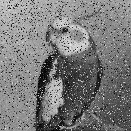
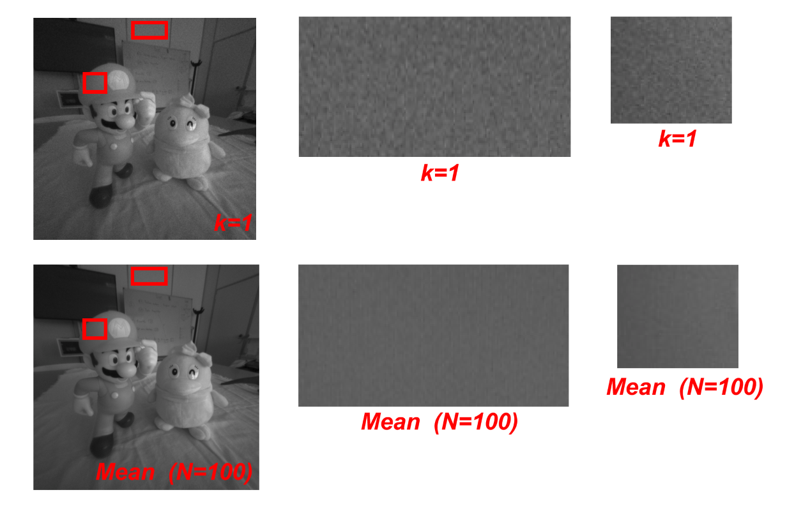
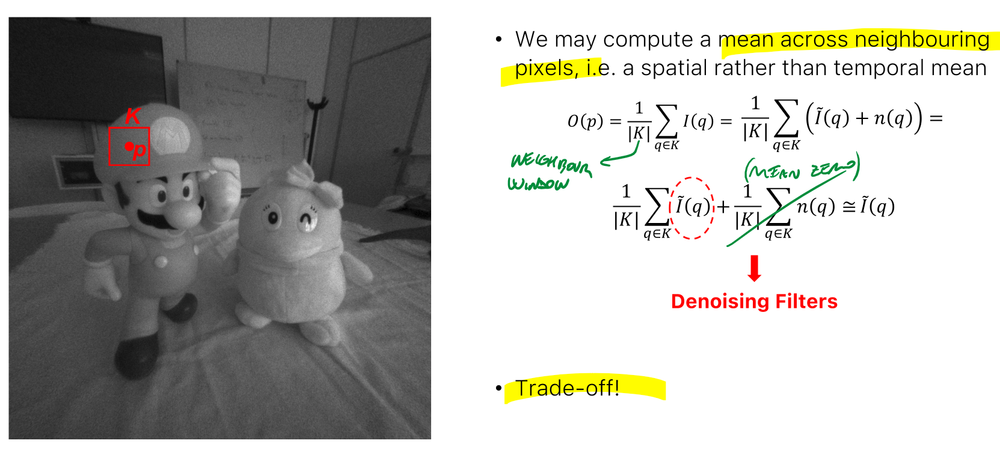

_Noise random variation of brightness or color information in images. Real images will present some sort of  unwanted fluctuations, due to errors in the capturing process. Noise makes CV techniques less accurate, thus it is important to reduce it as much as possible._ 
# Noise sources 
- **Photon Shot Noise –** The time between photon arrivals at a pixel is governed by a Poisson statistics and thus the number of photons collected during exposure time is not constant.  
- **Electronic Circuitry Noise –** It is generated by the electronics which reads-out the charge and amplifies the resulting voltage signal.  
- **Quantization Noise –** related to the final ADC conversion (in digital cameras), since quantization is an irreversible operation  
- **Dark Current Noise –** a random amount of charge due to thermal excitement is observed at each pixel even though the sensor is not exposed to light. 
 
Based on the source, the final effect can be one of these: 
## Impulse Noise 
 
AKA Salt and pepper. 
Many dots distributed randomly (Poisson, discrete) 
 
## Gaussian Noise 
 
Noise source that can be modelled with normal distribution, more noticeable on plain regions. 
It can be seen as a random variable (normal distribution with zero mean): 
$$I_k(p)=\tilde I(p)+n_k(p)$$ 
where $n_{k(p)} \sim N(0,\sigma)$  
 
# Noise reduction 
_Techniques of Image Processing that aim to reduce the amount of noise in an image, while minimizing the loss of quality._ 
## Denoising over time 
We can take multiple images of the same scene (assuming it's static), and make an average of the pixels. With a sufficient high number of images, the mean of the noise will be approximately zero (by definition). 
 
 
## Denoising over space 
Using multiple images is impractical (scenes are not static, will cause motion blur): 
we can take the mean over a neighborhood square of $K*K$ pixels. 
 
Bigger K means better smoothing (noise reduction), but also leads to blurry images (the window would be on the edge of an object, blending with the background) 
