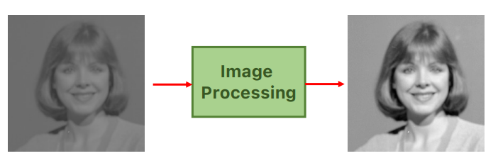

_aims at improving the quality of images. It's very useful to apply before a Computer Vision algorithm, as a Preprocessing step (simplifies analysis)._ 
 
 
For all data analysis applications it's valid the say "_Garbage in, garbage out_", which applies also to computer vision. 
Image processing allows to get the most out of the input data. 
In Deep Learning computer visiones, this process can also include data augmentation 
 
This operation includes: 
- functioning of the Pinhole Camera model 
- techniques to deal with Image Noise through Image Filters 
- Perform Edge Detection 
