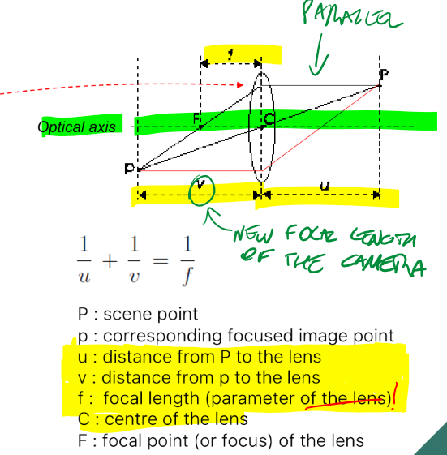
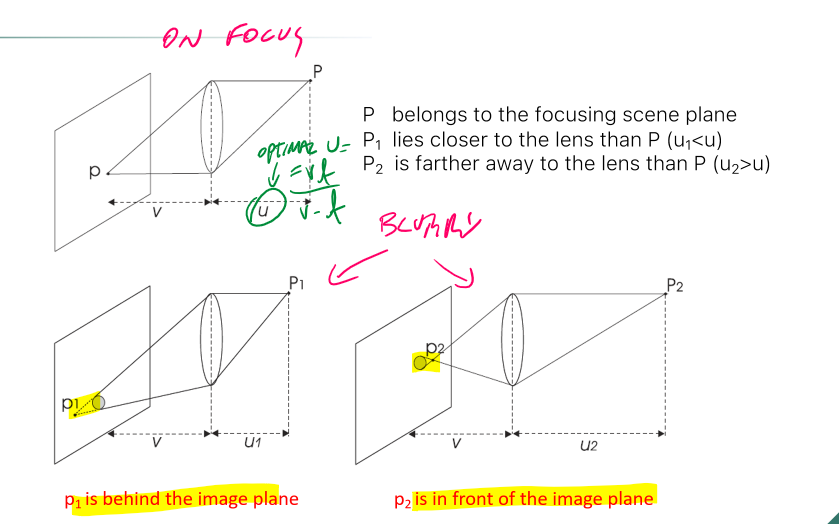
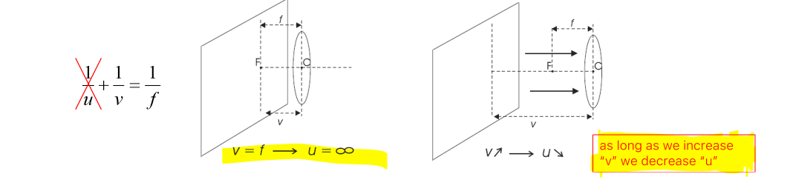

### Depth of Field (DOF) 
Defined as _the distance between the nearest and the furthest objects that are in acceptably sharp focus_. 
The pinhole camera model has _infinite DOF_ (everything is on focus on every distance), but it allows little lights in: requires long exposure times, and that leads to motion blur. 
To avoid motion blur we can use a larger hole (more light in), but we lose the infinite DOF, making blurry images. the solution is using lenses. 
# Thin lenses model 
Gather more light from scene point and focus it on a single image point. Enables small exposure times with much more light. DOF is not infinite. 
 
 
f, u and v are no longer the same as the Pinhole Camera Model. 
**THIN LENSES EQUATION:** $\frac{1}{u}+\frac{1}{v}=\frac{1}{f}$  
if f is fixed, when u increases, v decreases. 
 
**PROPERTIES**: 
1. Rays parallel to optical axis are deflected to pass through F 
2. Rays that pass through C are undeflected 
## Circles of confusion 
Scene points behind/in front of the focusing plane will be out of focus 
 
### Diaphragm 
Cameras ave adjustable diaphragms ti control the amount of light gathered through the hole of the lens. 
- small aperture= less light= smaller blur circle (motion blur) 
- big aperture= more light = larger blur circle (less motion blur) 
 
## Focusing mechanism 
In cameras, the lens can shift along the optical axis. 
 
if v=f, u=$\infty$ but u can only get so big. the maximum u defines the minimum distance at which an object can be on focus   
 
