_Simplest imaging device. Light goes through a very small pinhole and hits the image plane_ 
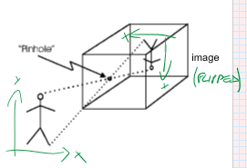 
## Perspective Projection 
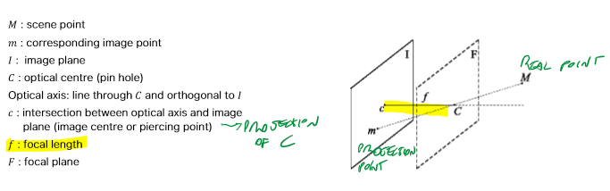 
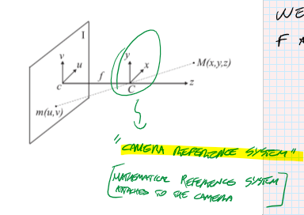 
The Image plane is _(u,v)_, the scene plane is _(x,y)_. We're assuming that they are parallel. 
With this assumption, the relation between the two planes is **proportional**. 
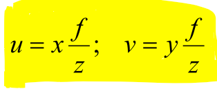 
(note: signs are positive only if we invert the z axis, which means putting the image plane BEFORE the scene plane). 
From this relation, the coefficient of the proportion are: 
- **z (depth)**: the higher, the smaller the image 
- **f (focal length)**: the bigger, the smaller the FOV (the bigger the image) 
 
# Perspective projection 
With 2D representations (projections) of the 3D space, we lose one dimension. This leads to information loss 
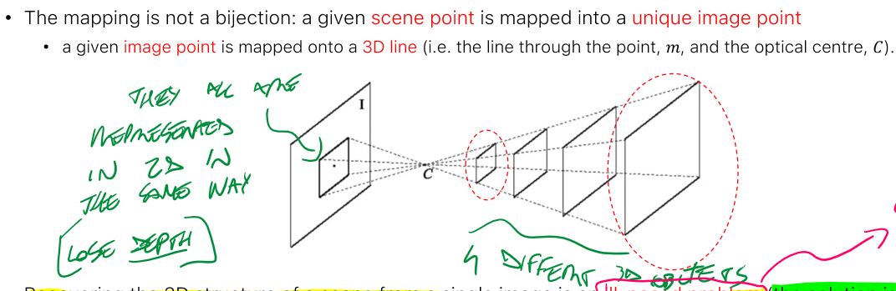 
**RECOVERING 3D STRUCTURE FROM SINGLE IMAGE IS AN ILL-POSED PROBLEM** 
 
## Stereo Geometry 
If one image is not enough, 2 is just right to fully solve this problem: 
Stereo images (just like our eyes), allow to infer 3D thanks to **triangulation**. 
 
We now have 2 image planes (and of course one scene plane), that needs to be perfectly aligned: 
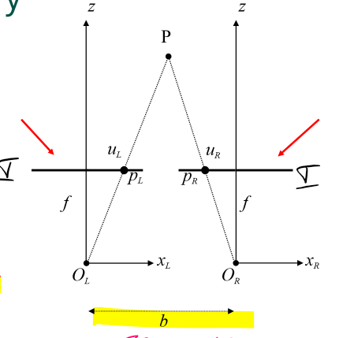 
- **b is the BASE LINE**, which is the distance between the two cameras. 
- **d is DISPARITY**: difference between the horizontal coordinates of the two images 
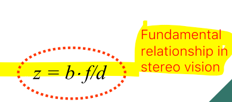 
if d is high, z is low (and viceversa). 
 
## Stereo matching 
since the two images are parallel, given a projection point $P_{L}$, if we want to find the respective $P_{R}$ point on the other image, we just need to follow the horizontal line that starts from Pl and search for a similar neighborhood of pixel on the right image (there are several algorithms to do so). 
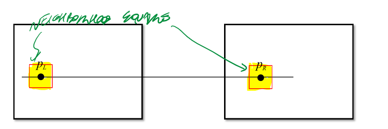 
 
## Epipolar Geometry and Rectification 
But what if the cameras are not aligned (in reality in fact this never happens). 
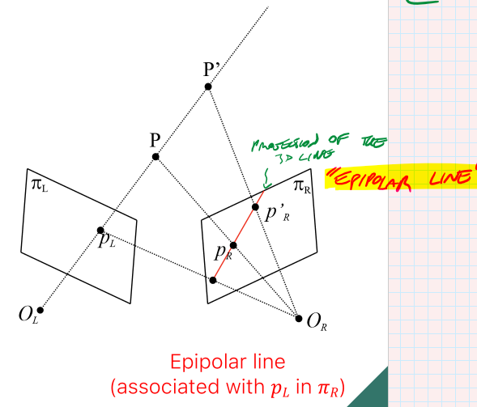 
The **epipolar line** is the projection of the first image's line which connects $P_L$ to P, projected to the first plane. 
This method is hard and not efficient though. 
It's simpler to just **rectify** both images (warping them) to virtually align them (so we can use straight horizontal lines again). 
**BEFORE** (find correspondace point by following the 
epipolar line) 
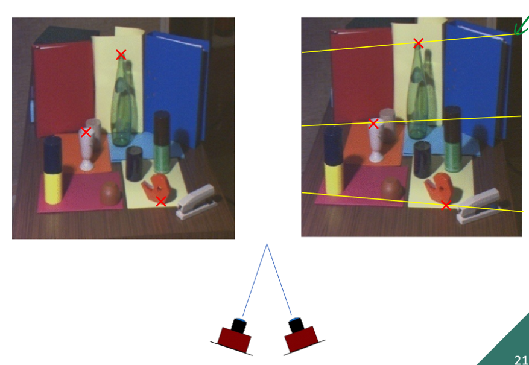 
**AFTER** (we can look at the correspondance point by following the horizontal line) 
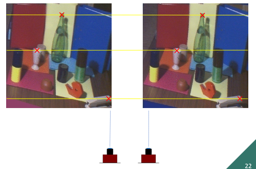 
This is possible thanks to Camera calibration#Homography. 
## Stereo correspondence 
When we look for the corresponding point on the left image, we can get an estimate of the distance from the camera 
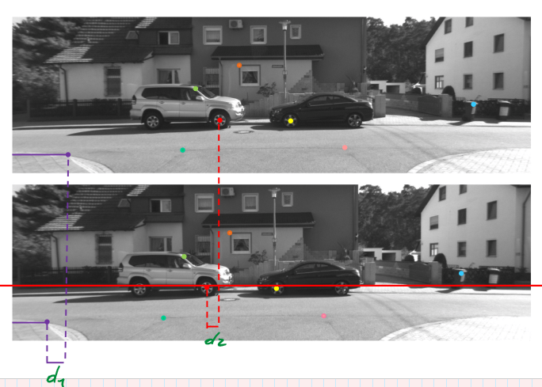 
points with bigger disparity are closer (d1>d2). 
 
# Vanishing point 
In projections, ratios of lengths are not preserved. 
Also, parallel scene lines actually converge in a point in the projection 
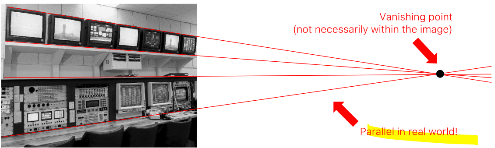 
### vanishing point of a 3d line 
the vanishing point of a 3d line  is the image of the point at infinity of the line